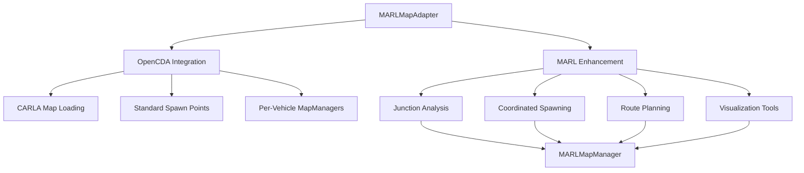

# Map Adapter API

The Map Adapter provides seamless integration between OpenCDA's single-vehicle map system and MARL's multi-agent coordination requirements. It enables the best of both worlds: OpenCDA's proven map loading capabilities with MARL-specific spawn coordination and route planning.

!!! info "Implementation Status"
    The Map Adapter is **fully implemented** and provides the recommended approach for map management in MARL scenarios, bridging OpenCDA compatibility with multi-agent coordination.

The Map Adapter follows a bridge pattern that preserves OpenCDA functionality while adding MARL capabilities:

```text
MARLMapAdapter
├── OpenCDA Integration    # Uses OpenCDA's proven map loading
│   ├── Map Loading       # load_customized_world() for XODR files
│   ├── MapManager        # Per-vehicle OpenCDA MapManagers
│   └── Spawn Points      # Standard CARLA spawn points
└── MARL Enhancement      # Adds multi-agent coordination
    ├── MARLMapManager    # Junction-based spawn coordination
    ├── Route Planning    # Spawn-destination pairs
    └── Visualization     # Debug tools for spawn points
```



## Core Classes

=== "MARLMapAdapter"

    The main adapter class that combines OpenCDA map loading with MARL spawn coordination.

    ```python
    class MARLMapAdapter:
        """
        Adapter that combines OpenCDA map loading with MARL spawn coordination.
        
        Architecture:
        - Uses OpenCDA for map loading and basic map operations
        - Uses MARLMapManager for multi-agent spawn/destination coordination
        - Provides unified interface for MARL scenarios
        
        Design Philosophy:
        - Preserve OpenCDA compatibility for single-vehicle operations
        - Add MARL-specific functionality without breaking existing code
        - Enable gradual migration and hybrid scenarios
        """
    ```

=== "Constructor"

    ```python
    def __init__(self, config: DictConfig, client: carla.Client):
        """
        Initialize map adapter.
        
        Parameters
        ----------
        config : DictConfig
            Configuration containing map and scenario settings
        client : carla.Client
            CARLA client instance
        """
    ```

#### Key Methods

=== "MARL Spawn Coordination"

    ```python
    def get_marl_spawn_points(self, num_agents: int, strategy: str = 'balanced') -> List[Dict[str, Any]]:
        """
        Get spawn points optimized for MARL scenarios.
        
        Parameters
        ----------
        num_agents : int
            Number of agents to spawn
        strategy : str
            Spawn strategy ('balanced', 'conflict', 'random')
            
        Returns
        -------
        spawn_info : list
            List of spawn information dicts with 'transform', 'dest', and 'id'
        """
        if strategy == 'balanced':
            # Use MARL manager for balanced spawning across intersection arms
            spawn_points = self.marl_map_manager.get_spawn_points(
                num=num_agents, dest=True, detail=True
            )
        elif strategy == 'conflict':
            # Get spawn points that create interesting coordination challenges
            all_spawns = self.marl_map_manager.get_spawn_points(detail=True)
            # Select spawns that maximize potential conflicts/interactions
            spawn_points = all_spawns[:num_agents] if len(all_spawns) >= num_agents else all_spawns
        else:  # random
            spawn_points = self.marl_map_manager.get_random_spawn_points(
                num=num_agents, detail=True
            )
        
        return spawn_points
    ```

=== "OpenCDA Compatibility"

    ```python
    def get_opencda_spawn_points(self, num_agents: int = None) -> List[carla.Transform]:
        """
        Get spawn points using OpenCDA's standard approach.
        
        Parameters
        ----------
        num_agents : int, optional
            Number of spawn points to return
            
        Returns
        -------
        spawn_points : list
            List of carla.Transform objects (standard OpenCDA format)
        """
        # Use CARLA's built-in spawn points (OpenCDA's standard approach)
        spawn_points = self.carla_map.get_spawn_points()
        
        if num_agents is not None:
            spawn_points = spawn_points[:num_agents]
        
        return spawn_points
    
    def create_opencda_map_manager(self, vehicle: carla.Vehicle, config: Dict) -> MapManager:
        """
        Create OpenCDA MapManager for a specific vehicle.
        
        Parameters
        ----------
        vehicle : carla.Vehicle
            Vehicle to create map manager for
        config : dict
            Map manager configuration
            
        Returns
        -------
        map_manager : MapManager
            OpenCDA MapManager instance for the vehicle
        """
        # Create standard OpenCDA MapManager for individual vehicle
        map_manager = MapManager(vehicle, self.carla_map, config)
        
        # Store reference for cleanup
        self.opencda_map_managers[vehicle.id] = map_manager
        
        return map_manager
    ```

=== "Route Planning"

    ```python
    def get_route_plan(self, agent_id: str) -> Optional[Tuple[carla.Transform, carla.Transform]]:
        """
        Get route plan (spawn-destination pair) for specific agent.
        
        Parameters
        ----------
        agent_id : str
            Agent identifier
            
        Returns
        -------
        route : tuple or None
            (spawn_transform, destination_transform) or None if not found
        """
        if not self.marl_map_manager:
            return None
        
        # Get spawn point info by ID
        spawn_points = self.marl_map_manager.get_spawn_points(detail=True)
        
        for spawn_info in spawn_points:
            if spawn_info['id'] == agent_id:
                return (spawn_info['transform'], spawn_info['dest'])
        
        return None
    ```

## Usage Examples

=== "Basic MARL Setup"

    ```python
    from opencda_marl.core.adapters.map_adapter import MARLMapAdapter
    from omegaconf import OmegaConf
    import carla
    
    # Load MARL configuration
    config = OmegaConf.load('configs/marl/intersection.yaml')
    
    # Connect to CARLA
    client = carla.Client("localhost", 2000)
    client.set_timeout(10.0)
    
    # Create map adapter
    map_adapter = MARLMapAdapter(config, client)
    
    # Get coordinated spawn points for 4 agents
    spawn_points = map_adapter.get_marl_spawn_points(
        num_agents=4, 
        strategy='balanced'
    )
    
    print(f"Generated {len(spawn_points)} coordinated spawn points:")
    for i, spawn_info in enumerate(spawn_points):
        print(f"  Agent {i}: {spawn_info['id']}")
        print(f"    Spawn: {spawn_info['transform'].location}")
        print(f"    Destination: {spawn_info['dest'].location}")
    ```

=== "OpenCDA Compatibility Mode"

    ```python
    # Use adapter in OpenCDA-compatible mode
    map_adapter = MARLMapAdapter(config, client)
    
    # Get standard OpenCDA spawn points
    opencda_spawns = map_adapter.get_opencda_spawn_points(num_agents=4)
    
    # Spawn vehicles using OpenCDA approach
    blueprint_library = world.get_blueprint_library()
    vehicle_bp = blueprint_library.filter('vehicle.tesla.model3')[0]
    
    vehicles = []
    for i, spawn_point in enumerate(opencda_spawns):
        vehicle = world.try_spawn_actor(vehicle_bp, spawn_point)
        if vehicle:
            vehicles.append(vehicle)
            
            # Create OpenCDA MapManager for this vehicle
            map_manager = map_adapter.create_opencda_map_manager(
                vehicle=vehicle,
                config=config.map_manager
            )
            print(f"Created OpenCDA MapManager for vehicle {vehicle.id}")
    ```

=== "Hybrid Approach"

    ```python
    # Use both MARL coordination and OpenCDA per-vehicle processing
    map_adapter = MARLMapAdapter(config, client)
    
    # 1. Get coordinated MARL spawn points
    marl_spawns = map_adapter.get_marl_spawn_points(
        num_agents=4,
        strategy='balanced'
    )
    
    # 2. Spawn vehicles at coordinated positions
    vehicles = []
    for spawn_info in marl_spawns:
        vehicle = world.try_spawn_actor(vehicle_bp, spawn_info['transform'])
        if vehicle:
            vehicles.append(vehicle)
    
    # 3. Create OpenCDA MapManagers for individual vehicle processing
    map_managers = {}
    for vehicle in vehicles:
        map_manager = map_adapter.create_opencda_map_manager(
            vehicle=vehicle,
            config=config.map_manager
        )
        map_managers[vehicle.id] = map_manager
        
        # Each vehicle now has both:
        # - Coordinated spawn/destination from MARL
        # - Individual OpenCDA MapManager for perception/planning
    ```

=== "Route Planning Integration"

    ```python
    # Get route plans for coordinated agents
    spawn_points = map_adapter.get_marl_spawn_points(num_agents=4, strategy='balanced')
    
    for spawn_info in spawn_points:
        agent_id = spawn_info['id']
        
        # Get detailed route plan
        route = map_adapter.get_route_plan(agent_id)
        if route:
            spawn_transform, dest_transform = route
            
            print(f"Agent {agent_id} route plan:")
            print(f"  Start: ({spawn_transform.location.x:.1f}, {spawn_transform.location.y:.1f})")
            print(f"  End: ({dest_transform.location.x:.1f}, {dest_transform.location.y:.1f})")
            
            # Calculate route distance
            distance = spawn_transform.location.distance(dest_transform.location)
            print(f"  Distance: {distance:.1f} meters")
    ```

## Spawn Strategies

The adapter supports multiple spawn strategies for different research needs:

=== "Balanced Strategy"

    ```python
    # Distribute agents evenly across intersection arms
    spawn_points = map_adapter.get_marl_spawn_points(
        num_agents=4,
        strategy='balanced'
    )
    # Result: One agent per intersection arm for balanced coordination
    ```

=== "Conflict Strategy"

    ```python
    # Create challenging coordination scenarios
    spawn_points = map_adapter.get_marl_spawn_points(
        num_agents=4,
        strategy='conflict'
    )
    # Result: Spawn points selected to maximize potential conflicts/interactions
    ```

=== "Random Strategy"

    ```python
    # Random spawn selection for variability
    spawn_points = map_adapter.get_marl_spawn_points(
        num_agents=4,
        strategy='random'
    )
    # Result: Randomly selected spawn points with destinations
    ```

## Visualization and Debugging

=== "Spawn Point Visualization"

    ```python
    # Visualize both MARL and OpenCDA spawn points
    map_adapter.visualize_spawn_points(
        mode='both',  # 'marl', 'opencda', or 'both'
        life_time=30.0
    )
    
    # MARL spawn points: Magenta (spawn) and Black (destination) 
    # OpenCDA spawn points: Yellow markers
    # Junction centers: Red with green bounding boxes
    ```

=== "Detailed Junction Visualization"

    ```python
    # Access underlying MARL map manager for detailed visualization
    marl_manager = map_adapter.marl_map_manager
    
    # Draw junction analysis
    marl_manager.draw_junction_centers(life_time=60.0)
    
    # Draw spawn-destination connections
    marl_manager.draw_spawn_points(life_time=60.0)
    
    # Print junction information
    for junction in marl_manager.get_info()['junctions']:
        print(f"Junction {junction['id']}:")
        print(f"  Center: {junction['center']}")
        print(f"  Connections: {len(junction['connections'])}")
    ```

## Configuration Integration

=== "Map Configuration"

    ```yaml
    # configs/marl/intersection.yaml
    map:
      name: intersection                    # Map to load
      safe_distance: 5.0                   # Base spacing for spawn points
      spawn_offset: 2                      # Spawn distance from junction (multiples of safe_distance)  
      dest_offset: 2                       # Destination distance from junction
      spawn_z_lift: 0.3                    # Z-axis lift to avoid ground collision
      wp_step: 1.0                         # Waypoint stepping granularity
    
    # OpenCDA MapManager configuration (per vehicle)
    map_manager:
      activate: true                       # Enable map manager
      visualize: false                     # Disable per-vehicle visualization  
      pixels_per_meter: 5                  # Rasterization resolution
      raster_size: [224, 224]              # Raster image size
      lane_sample_resolution: 2.0          # Lane sampling resolution
    ```

=== "Spawn Strategy Configuration"

    ```yaml
    # MARL-specific spawn configuration
    marl:
      spawn_strategy: balanced             # 'balanced', 'conflict', 'random'
      agents:
        num_agents: 4                      # Number of agents to spawn
    ```

## Compatibility Matrix

| Feature | OpenCDA Mode | MARL Mode | Hybrid Mode |
|---------|--------------|-----------|-------------|
| **Map Loading** | ✅ Standard CARLA | ✅ Via MARLMapManager | ✅ MARLMapManager |
| **Spawn Points** | ✅ CARLA built-in | ✅ Coordinated pairs | ✅ Both available |
| **Route Planning** | ❌ Not available | ✅ Spawn-destination pairs | ✅ MARL coordination |
| **Per-Vehicle Maps** | ✅ Standard MapManager | ❌ Not needed | ✅ OpenCDA MapManagers |
| **Visualization** | ✅ Per-vehicle BEV | ✅ Junction/spawn debug | ✅ Both systems |


---

**Location**: `opencda_marl/core/adapters/map_adapter.py`