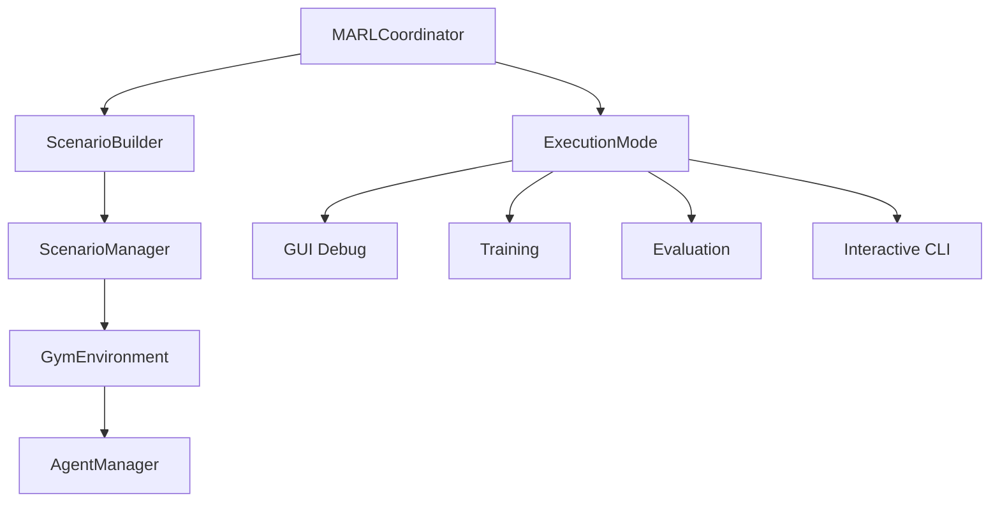

# MARL Coordinator API

The MARL Coordinator is the central orchestrator for multi-agent reinforcement learning scenarios in OpenCDA-MARL. It provides unified control over simulation execution, managing the interaction between scenario management, environment interfaces, and agent execution.

!!! info "Implementation Status"
    The MARL Coordinator is **fully implemented** and provides the primary interface for MARL scenario execution with multiple modes: GUI debugging, training, evaluation, and interactive CLI.

```text
MARLCoordinator
├── Scenario Management    # ScenarioBuilder → ScenarioManager
├── Environment Interface  # Gym wrapper for standard RL API
├── Agent Management      # RL algorithms and policies  
├── Execution Modes      # GUI, Training, Evaluation, CLI
└── Callback System      # Pre/post step and episode hooks
```

The coordinator follows a clear architectural flow:



## Core Classes

=== "MARLCoordinator"

    The main orchestration class that coordinates all MARL components.

    ```python
    class MARLCoordinator:
        """
        High-level coordinator for MARL experiments.
        
        Orchestrates interaction between:
        - Scenario management (CARLA simulation)
        - Agent management (RL policies) 
        - Environment interface (Gym API)
        - User interfaces (GUI/CLI)
        """
    ```

=== "Constructor"

    ```python
    def __init__(
        self,
        config: Dict,
        mode: ExecutionMode = ExecutionMode.DEMO,
        enable_gui: bool = False
    ):
        """
        Initialize MARL Coordinator.
        
        Parameters
        ----------
        config : dict
            Combined OpenCDA and MARL configuration
        mode : ExecutionMode
            Execution mode (TRAINING, GUI_DEBUG, EVALUATION, DEMO)
        enable_gui : bool
            Whether to enable GUI interface
        """
    ```

=== "ExecutionMode"

    Enumeration defining different execution modes for the coordinator.

    ```python
    class ExecutionMode(Enum):
        """Execution modes for MARL coordinator."""
        TRAINING = "training"      # Automated RL training
        GUI_DEBUG = "gui_debug"    # Step-by-step GUI control
        EVALUATION = "evaluation"  # Policy evaluation
        DEMO = "demo"             # Demonstration mode
    ```

=== "Key Methods"

    === "Initialization"

        ```python
        def initialize(self):
            """
            Initialize all components following the proper architecture:
            Coordinator -> ScenarioBuilder -> ScenarioManager -> GymEnv
            """
            # 1. Create CAV world
            self.cav_world = CavWorld(apply_ml=False)
            
            # 2. Use ScenarioBuilder to create appropriate scenario manager
            self.scenario_manager = self.scenario_builder.build_from_config(
                config=self.config,
                cav_world=self.cav_world
            )
            
            # 3. Wrap scenario manager with Gym environment
            self.gym_env = MARLGymEnv(
                scenario_manager=self.scenario_manager,
                config=self.config,
                render_mode='human',
                max_episode_steps=500
            )
        ```

    === "Step Execution"

        ```python
        def step(self, external_actions: Optional[Dict[str, Any]] = None) -> Dict[str, Any]:
            """
            Execute one coordinated step through Gym environment.
            
            Parameters
            ----------
            external_actions : dict, optional
                External actions (from GUI or specific algorithms)
            
            Returns
            -------
            step_info : dict
                Complete step information with Gym format
            """
            # Execute pre-step callbacks
            for callback in self.pre_step_callbacks:
                callback(self)
            
            # Get actions (from external source or agents)
            if external_actions:
                actions = external_actions
            else:
                current_obs = self.gym_env._get_observations()
                actions = self.agent_manager.get_actions(current_obs)
            
            # Execute step through Gym environment
            observations, rewards, dones, truncated, info = self.gym_env.step(actions)
            
            # Combine information and execute post-step callbacks
            step_info = {
                'step': self.current_step,
                'episode': self.current_episode,
                'actions': actions,
                'observations': observations,
                'rewards': rewards,
                'dones': dones,
                'truncated': truncated,
                'metrics': info.get('metrics', {}),
                'gym_info': info
            }
            
            for callback in self.post_step_callbacks:
                callback(self, step_info)
            
            return step_info
        ```

    === "Episode Management"

        ```python
        def reset_episode(self) -> Dict[str, Any]:
            """Reset for new episode through Gym environment."""
            initial_observations, info = self.gym_env.reset()
            
            self.current_step = 0
            self.current_episode += 1
            
            # Execute episode callbacks
            for callback in self.episode_callbacks:
                callback(self)
            
            return {
                'episode': self.current_episode,
                'step': self.current_step,
                'observations': initial_observations,
                'agent_ids': info.get('agent_ids', []),
                'gym_info': info
            }
        ```


## Usage Examples

=== "Basic Usage"

    ```python
    from opencda_marl.core.coordinator import MARLCoordinator, ExecutionMode
    from omegaconf import OmegaConf
    
    # Load configuration
    config = OmegaConf.load('configs/marl/intersection.yaml')
    
    # Create coordinator
    coordinator = MARLCoordinator(
        config=config,
        mode=ExecutionMode.DEMO
    )
    
    # Initialize all components
    coordinator.initialize()
    
    # Run a few steps
    for _ in range(10):
        step_info = coordinator.step()
        print(f"Step {step_info['step']}: Rewards = {step_info['rewards']}")
    ```

=== "Training Mode"

    ```python
    # Training mode with automated episode management
    coordinator = MARLCoordinator(
        config=config,
        mode=ExecutionMode.TRAINING
    )
    
    coordinator.initialize()
    
    # Run training for 100 episodes
    results = coordinator.run_training(num_episodes=100)
    
    # Analyze results
    avg_reward = sum(r['total_reward'] for r in results) / len(results)
    print(f"Average reward over training: {avg_reward:.2f}")
    ```

=== "GUI Debug Mode"

    ```python
    # GUI mode with step-by-step control
    coordinator = MARLCoordinator(
        config=config,
        mode=ExecutionMode.GUI_DEBUG,
        enable_gui=True
    )
    
    coordinator.initialize()
    
    # Launch GUI interface (blocks until window closes)
    coordinator.run_gui_mode()
    ```

=== "Interactive CLI"

    ```python
    # Interactive command-line interface
    coordinator = MARLCoordinator(config=config)
    coordinator.initialize()
    
    # Start interactive session
    coordinator.run_interactive_cli()
    
    # Available commands:
    # - step: Execute single step
    # - run [n]: Run n steps (default 10)
    # - reset: Reset episode
    # - train [n]: Run training for n episodes  
    # - quit: Exit
    ```


## Integration Points

The coordinator serves as the central integration point for all MARL components:

| Component           | Integration Method   | Purpose                                          |
| ------------------- | -------------------- | ------------------------------------------------ |
| **ScenarioBuilder** | Direct instantiation | Creates scenario managers based on configuration |
| **ScenarioManager** | Via builder          | Manages CARLA simulation and vehicle spawning    |
| **GymEnvironment**  | Wrapper pattern      | Provides standard RL API over scenario manager   |
| **AgentManager**    | Direct integration   | Manages RL algorithms and policy execution       |
| **GUI Components**  | Callback system      | Provides visual debugging and control interface  |


=== "Callback System"

    The coordinator provides a comprehensive callback system for extending functionality:
    
    === "Registering Callbacks"

        ```python
        def pre_step_callback(coordinator):
            """Called before each step execution."""
            print(f"About to execute step {coordinator.current_step + 1}")
        
        def post_step_callback(coordinator, step_info):
            """Called after each step execution."""
            total_reward = sum(step_info['rewards'].values())
            print(f"Step completed. Total reward: {total_reward:.3f}")
        
        def episode_callback(coordinator):
            """Called at start of new episode."""
            print(f"Starting episode {coordinator.current_episode}")
        
        # Register callbacks
        coordinator.register_pre_step_callback(pre_step_callback)
        coordinator.register_post_step_callback(post_step_callback)
        coordinator.register_episode_callback(episode_callback)
        ```

    === "GUI Integration Example"

        ```python
        class CustomGUIController:
            def __init__(self, coordinator):
                self.coordinator = coordinator
                
                # Register for step updates
                coordinator.register_post_step_callback(self.update_display)
        
            def update_display(self, coordinator, step_info):
                """Update GUI with step information."""
                self.step_label.setText(f"Step: {step_info['step']}")
                self.reward_label.setText(f"Reward: {sum(step_info['rewards'].values()):.3f}")
        ```

=== "Error Handling"

    The coordinator implements comprehensive error handling:

    ```python
    try:
        coordinator.initialize()
        step_info = coordinator.step()
    except ValueError as e:
        print(f"Configuration error: {e}")
    except RuntimeError as e:
        print(f"Simulation error: {e}")
    except KeyboardInterrupt:
        print("Training interrupted by user")
        coordinator.stop()
    finally:
        coordinator.close()
    ```

=== "Thread Safety"

    The coordinator is **not thread-safe**. If using in multi-threaded environments (e.g., with Ray), create separate coordinator instances for each worker process.