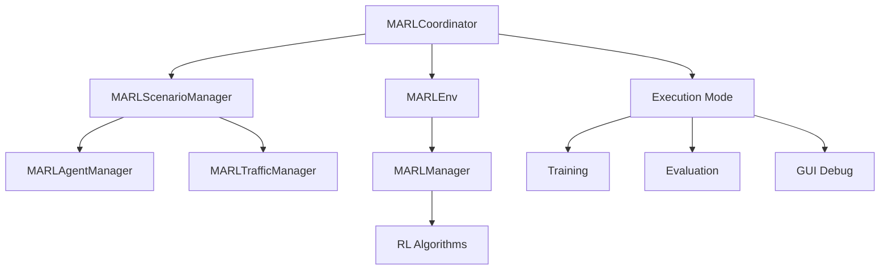

# MARL Coordinator API

The MARL Coordinator is the central orchestrator for multi-agent reinforcement learning scenarios in OpenCDA-MARL. It provides unified control over simulation execution, managing the interaction between scenario management, environment interfaces, and agent execution.

!!! success "Implementation Status"
    The MARL Coordinator is **fully implemented** and provides the primary interface for MARL scenario execution. It supports CLI training mode and PySide6 GUI mode with real-time visualization.

```text
MARLCoordinator
├── Scenario Management    # MARLScenarioManager setup and control
├── Environment Interface  # MARLEnv for RL training loop
├── Agent Management      # MARLManager for RL algorithms
├── Execution Modes      # Training, Evaluation, GUI
└── Callback System      # Pre/post step and episode hooks
```

The coordinator follows a clear architectural flow:



## Core Classes

=== "MARLCoordinator"

    The main orchestration class that coordinates all MARL components.

    ```python
    class MARLCoordinator:
        """
        High-level coordinator for MARL experiments.

        Orchestrates interaction between:
        - Scenario management (CARLA simulation)
        - MARLEnv (RL training environment)
        - MARLManager (RL algorithms and policies)
        - User interfaces (GUI/CLI)
        """
    ```

=== "Constructor"

    ```python
    def __init__(self, config: Dict):
        """
        Initialize MARL Coordinator.

        Parameters
        ----------
        config : dict
            Combined OpenCDA and MARL configuration (OmegaConf)
        """
    ```

=== "Key Methods"

    === "Initialization"

        ```python
        def initialize(self):
            """
            Initialize all components following the architecture:
            Coordinator -> MARLScenarioManager -> MARLEnv -> MARLManager

            Sets up CARLA client, world, scenario manager,
            environment, and RL algorithm manager.
            """
        ```

    === "Step Execution"

        ```python
        def step(self) -> Dict[str, Any]:
            """
            Execute one coordinated step through MARLEnv.

            Returns
            -------
            step_info : dict
                Complete step information including:
                - step: Current step number
                - episode: Current episode number
                - observations: Agent observations
                - rewards: Agent rewards
                - events: Step events (collisions, completions)
                - metrics: Training metrics
            """
        ```

    === "Episode Management"

        ```python
        def reset_episode(self) -> Dict[str, Any]:
            """
            Reset for new episode.

            Returns
            -------
            episode_info : dict
                Initial episode state with observations
            """
        ```

    === "Run Training"

        ```python
        def run(self):
            """
            Main execution loop.

            Handles full training/evaluation lifecycle:
            - Episode loop with configurable max_episodes
            - Step loop with configurable max_steps
            - Checkpoint saving and metrics logging
            - World reset at configurable intervals
            """
        ```

    === "GUI Mode"

        ```python
        def run_gui_mode(self):
            """
            Launch PySide6 GUI dashboard for interactive control.

            Provides real-time visualization of:
            - Agent observations and rewards
            - Training metrics and plots
            - Step-by-step execution control
            """
        ```

## Usage Examples

=== "Basic Usage"

    ```python
    from opencda_marl.coordinator import MARLCoordinator
    from omegaconf import OmegaConf

    # Load configuration
    config = OmegaConf.merge(
        OmegaConf.load('configs/marl/default.yaml'),
        OmegaConf.load('configs/marl/td3_simple_v4.yaml')
    )

    # Create and initialize coordinator
    coordinator = MARLCoordinator(config=config)
    coordinator.initialize()

    # Run training
    coordinator.run()
    ```

=== "Training Mode"

    ```python
    # Training with specific algorithm
    config = OmegaConf.merge(
        OmegaConf.load('configs/marl/default.yaml'),
        OmegaConf.load('configs/marl/td3_simple_v4.yaml')
    )
    # Ensure training mode
    config.MARL.training = True

    coordinator = MARLCoordinator(config=config)
    coordinator.initialize()
    coordinator.run()
    ```

=== "GUI Debug Mode"

    ```python
    # GUI mode with PySide6 dashboard
    coordinator = MARLCoordinator(config=config)
    coordinator.initialize()
    coordinator.run_gui_mode()
    ```

=== "CLI Execution"

    ```bash
    # Train with TD3
    python opencda.py -t td3_simple_v4 --marl

    # Train with GUI
    python opencda.py -t td3_simple_v4 --marl --gui

    # Evaluate with vanilla baseline
    python opencda.py -t vanilla --marl
    ```

## Integration Points

The coordinator serves as the central integration point for all MARL components:

| Component              | Integration Method   | Purpose                                        |
| ---------------------- | -------------------- | ---------------------------------------------- |
| **MARLScenarioManager** | Direct instantiation | Manages CARLA simulation and vehicle spawning  |
| **MARLEnv**            | Wraps scenario manager | Provides RL training loop (obs, reward, done) |
| **MARLManager**        | Via MARLEnv          | Manages RL algorithms and policy execution     |
| **MARLAgentManager**   | Via scenario manager | Multi-agent lifecycle management               |
| **GUI Dashboard**      | Callback system      | PySide6 visual debugging and control           |

=== "Callback System"

    The coordinator provides a callback system for extending functionality:

    ```python
    def pre_step_callback(coordinator):
        """Called before each step execution."""
        print(f"About to execute step {coordinator.current_step + 1}")

    def post_step_callback(coordinator, step_info):
        """Called after each step execution."""
        total_reward = sum(step_info['rewards'].values())
        print(f"Step completed. Total reward: {total_reward:.3f}")

    def episode_callback(coordinator):
        """Called at start of new episode."""
        print(f"Starting episode {coordinator.current_episode}")

    # Register callbacks
    coordinator.pre_step_callbacks.append(pre_step_callback)
    coordinator.post_step_callbacks.append(post_step_callback)
    coordinator.episode_callbacks.append(episode_callback)
    ```

=== "Error Handling"

    ```python
    try:
        coordinator.initialize()
        coordinator.run()
    except ValueError as e:
        print(f"Configuration error: {e}")
    except RuntimeError as e:
        print(f"Simulation error: {e}")
    except KeyboardInterrupt:
        print("Training interrupted by user")
    finally:
        coordinator.close()
    ```

=== "Thread Safety"

    The coordinator is **not thread-safe**. If using in multi-threaded environments, create separate coordinator instances for each worker process.

---

**Location**: `opencda_marl/coordinator.py`
