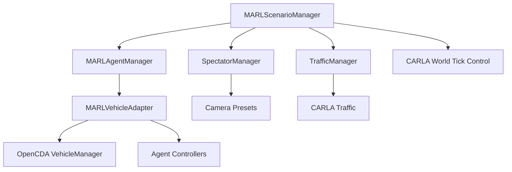

# Scenario API

!!! success "Implementation Status"
    The Scenario system is **fully implemented** with MARLScenarioManager providing enhanced multi-agent capabilities while maintaining full OpenCDA compatibility.

The Scenario system provides comprehensive scenario management for multi-agent reinforcement learning, extending OpenCDA's proven scenario management with MARL-specific capabilities like dynamic vehicle spawning, coordinated agent management, and collision handling.

```text
MARL Scenario System
├── MARLScenarioManager    # Enhanced scenario manager with MARL capabilities
├── MARLAgentManager       # Multi-agent coordination and lifecycle management
├── MARLVehicleAdapter     # Individual vehicle-agent bridge
├── SpectatorManager       # Camera and visualization management
└── ScenarioBuilder        # Factory for dynamic scenario creation (legacy)
```

The system extends OpenCDA's scenario management with MARL capabilities:



## Core Classes

=== "MARLScenarioManager"

    Enhanced scenario manager that extends OpenCDA's capabilities with multi-agent coordination.

    ```python
    class MARLScenarioManager:
        """
        Enhanced scenario manager for MARL experiments.
        
        Extends OpenCDA's ScenarioManager with:
        - Multi-agent coordination through MARLAgentManager
        - Dynamic vehicle spawning and lifecycle management
        - External action integration for RL agents
        - Collision handling with instant destruction
        - Camera and spectator management
        """
    ```

=== "Constructor"

    ```python
    def __init__(self, scenario_params: Dict, apply_ml,
                 xodr_path: Optional[str] = None, town: Optional[str] = None,
                 cav_world: Optional[CavWorld] = None):
        """
        Initialize MARL scenario manager.

        Parameters
        ----------
        scenario_params : dict
            OpenCDA scenario configuration
        apply_ml : bool
            Whether to apply ML models
        xodr_path : str, optional
            Path to custom OpenDRIVE map
        town : str, optional
            CARLA town name
        cav_world : CavWorld, optional
            CAV world for coordination
        """
    ```

### Key Methods

=== "Episode Management"

    ```python
    def reset(self) -> None:
        """
        Reset scenario for new episode.
        
        Clears all vehicles, resets managers, and prepares for fresh episode.
        Maintains CARLA world connection.
        """
    
    def step(self, external_actions: Optional[Dict[str, Any]] = None) -> Dict[str, Any]:
        """
        Execute one simulation step.
        
        Parameters
        ----------
        external_actions : dict, optional
            External actions for agents (agent_id -> action)
        
        Returns
        -------
        step_info : dict
            Step information including:
            - agents: Active agent adapters
            - traffic_info: Traffic state information
            - scenario_state: Current scenario state
        """
    ```

=== "Agent Access"

    ```python
    @property
    def agents(self) -> Dict[str, MARLVehicleAdapter]:
        """
        Get active agent adapters.
        
        Returns
        -------
        agents : dict
            Active agents (agent_id -> MARLVehicleAdapter)
        """
    
    def get_traffic_info(self) -> Dict[str, Any]:
        """
        Get current traffic state information.
        
        Returns
        -------
        traffic_info : dict
            Current traffic state and statistics
        """
    ```

=== "MARLAgentManager"

    Manages multiple vehicle agents and their lifecycle.

    ```python
    class MARLAgentManager:
        """
        Manages multiple vehicle agents for MARL scenarios.
        
        Handles:
        - Vehicle spawning and destruction
        - Agent-vehicle adapter mapping
        - External action distribution
        - Collision detection and cleanup
        """
    ```

=== "Constructor"

    ```python
    def __init__(self, config: Dict[str, Any], state: Dict[str, Any],
                 world: carla.World, cav_world):
        """
        Initialize agent manager.

        Parameters
        ----------
        config : dict
            Agent configuration
        state : dict
            Shared simulation state (traffic events, map data)
        world : carla.World
            CARLA world instance
        cav_world : CavWorld
            CAV world for coordination
        """
    ```

### Agent Manager Methods

=== "Agent Lifecycle"

    ```python
    def spawn_vehicles(self, num_vehicles: int = None) -> int:
        """
        Spawn new vehicles with agents.
        
        Parameters
        ----------
        num_vehicles : int, optional
            Number of vehicles to spawn (uses config default if None)
            
        Returns
        -------
        spawned_count : int
            Number of successfully spawned vehicles
        """
    
    def cleanup(self) -> None:
        """
        Clean up all vehicles and agents.
        
        Destroys all CARLA actors and clears internal tracking.
        """
    
    def reset_episode(self) -> None:
        """
        Reset for new episode.
        
        Clears existing vehicles and prepares for new spawning.
        """
    ```

=== "Step Execution"

    ```python
    def step(self, external_actions: Optional[Dict[str, Any]] = None) -> Dict[str, Any]:
        """
        Execute step for all agents.
        
        Parameters
        ----------
        external_actions : dict, optional
            External actions (agent_id -> action)
            
        Returns
        -------
        step_result : dict
            Results from all agent steps
        """
    ```

=== "MARLVehicleAdapter"

    Individual vehicle-agent adapter that bridges OpenCDA VehicleManager with RL agents.

    ```python
    class MARLVehicleAdapter:
        """
        Adapter that bridges OpenCDA VehicleManager with RL agents.
        
        Features:
        - Multiple controller types (behavior, vanilla, rule_based, marl)
        - External speed control for RL agents
        - Collision detection with instant destruction
        - Observation extraction for RL
        """
    ```

=== "Controller Types"

    ```python
    # Available controller types
    CONTROLLER_TYPES = {
        'behavior': "OpenCDA BehaviorAgent (standard autonomous)",
        'vanilla': "VanillaAgent (enhanced collision avoidance)",
        'rule_based': "3-stage intersection rules",
        'marl': "MARL RL-controlled agent (speed control)"
    }
    ```

=== "Key Adapter Methods"

    ```python
    def run_step(self, target_speed: Optional[float] = None) -> carla.VehicleControl:
        """
        Execute one control step.
        
        Parameters
        ----------
        target_speed : float, optional
            Target speed for external control (km/h)
            
        Returns
        -------
        control : carla.VehicleControl
            Vehicle control command
        """
    
    def get_observation(self) -> Dict[str, Any]:
        """
        Get vehicle observation for RL.
        
        Returns
        -------
        observation : dict
            Vehicle state observation including:
            - position: Vehicle location
            - velocity: Vehicle velocity
            - rotation: Vehicle orientation
            - nearby_vehicles: Surrounding traffic
        """
    
    def destroy(self) -> None:
        """
        Destroy vehicle actor and clean up resources.
        
        Called automatically on collision when instant_destruction is enabled.
        """
    ```

## Usage Examples

=== "Basic Scenario Setup"

    ```python
    from opencda_marl.scenarios.scenario_manager import MARLScenarioManager
    from opencda.core.common.cav_world import CavWorld
    import carla
    
    # Connect to CARLA
    client = carla.Client("localhost", 2000)
    client.set_timeout(10.0)
    
    # Create CAV world
    cav_world = CavWorld(apply_ml=False)
    
    # Create scenario manager
    scenario_manager = MARLScenarioManager(
        config=config,
        client=client, 
        cav_world=cav_world
    )
    
    # Spawn initial vehicles
    num_spawned = scenario_manager.agent_manager.spawn_vehicles(num_vehicles=4)
    print(f"Spawned {num_spawned} vehicles")
    
    # Execute simulation steps
    for step in range(100):
        step_info = scenario_manager.step()
        print(f"Step {step}: {len(step_info['agents'])} active agents")
    ```

=== "External Action Control"

    ```python
    # Control agents with external actions
    external_actions = {
        'north_0_12345': 25.0,  # Target speed 25 km/h
        'south_1_67890': 30.0,  # Target speed 30 km/h
    }
    
    step_info = scenario_manager.step(external_actions)
    
    # Check agent states after control
    for agent_id, adapter in step_info['agents'].items():
        vehicle = adapter.vehicle
        speed = vehicle.get_velocity().length() * 3.6  # Convert to km/h
        print(f"Agent {agent_id}: Current speed = {speed:.1f} km/h")
    ```

=== "Agent Observation Collection"

    ```python
    # Collect observations from all agents
    observations = {}
    
    for agent_id, adapter in scenario_manager.agents.items():
        obs = adapter.get_observation()
        observations[agent_id] = obs
        
        print(f"Agent {agent_id} observation:")
        print(f"  Position: {obs['position']}")
        print(f"  Speed: {obs.get('speed', 0):.1f} m/s")
    
    # Use observations for RL training
    # rewards = calculate_rewards(observations)
    # actions = policy.get_actions(observations)
    ```

=== "Episode Management"

    ```python
    # Complete episode workflow
    def run_episode(scenario_manager, max_steps=500):
        """Run complete MARL episode."""
        
        # Reset for new episode
        scenario_manager.reset()
        
        # Spawn vehicles
        num_spawned = scenario_manager.agent_manager.spawn_vehicles()
        print(f"Episode started with {num_spawned} vehicles")
        
        episode_data = []
        
        for step in range(max_steps):
            # Get current observations
            observations = {
                agent_id: adapter.get_observation() 
                for agent_id, adapter in scenario_manager.agents.items()
            }
            
            # Generate actions (placeholder for RL)
            actions = {}  # Autonomous control
            
            # Execute step
            step_info = scenario_manager.step(actions)
            
            # Store episode data
            episode_data.append({
                'step': step,
                'observations': observations,
                'actions': actions,
                'agents': list(step_info['agents'].keys())
            })
            
            # Check termination
            if not step_info['agents']:
                print(f"Episode ended at step {step} - no active agents")
                break
        
        return episode_data
    ```

## Configuration Integration

=== "Agent Configuration"

    ```yaml
    # Agent behavior configuration
    agents:
      vehicle:
        controller: "rule_based"          # Controller type
        safety_manager:
          instant_destruction: true      # Destroy on collision
          collision_sensor:
            col_thresh: 1                # Collision threshold
            history_size: 30             # Collision history
    
      # Controller-specific configurations
      rule_based:
        junction_approach_distance: 70.0  # Distance to start junction management
        cautious_speed: 20.0             # Speed when conflict detected
        time_headway: 2.0                # Car following time headway
    
      vanilla:
        intersection_safety_multiplier: 2.0  # Safety multiplier at intersections
        multi_vehicle_ttc: true          # Enable multi-vehicle TTC tracking
    ```

=== "Scenario Configuration"

    ```yaml
    scenario:
      name: "intersection"
      map:
        name: "intersection"
        safe_distance: 5.0
        spawn_offset: 2
      
      # Traffic management
      traffic_manager:
        rate_vph: 400                    # Vehicle spawn rate
        min_headway_s: 2.0              # Minimum following distance
        
      # MARL-specific settings
      agents:
        num_agents: 4                    # Number of RL agents
        spawn_strategy: "balanced"       # Spawn distribution strategy
    ```

## Integration Points

=== "MARLEnvironment Integration"

    ```python
    # MARLEnvironment uses MARLScenarioManager
    class MARLEnvironment:
        def __init__(self, scenario_manager: MARLScenarioManager, config):
            self.scenario_manager = scenario_manager
        
        def step(self, actions):
            # Execute through scenario manager
            scenario_result = self.scenario_manager.step(actions)
            
            # Extract observations, rewards, dones
            observations = self._get_observations()
            rewards = self._calculate_rewards(scenario_result)
            dones = self._check_termination()
            
            return {
                'observations': observations,
                'rewards': rewards,
                'dones': dones,
                'scenario_info': scenario_result
            }
    ```

=== "Benchmark Integration"

    ```python
    # BenchmarkComparator uses MARLScenarioManager through coordinator
    from opencda_marl.coordinator import MARLCoordinator
    
    def run_agent_test(agent_type, scenario, timeout):
        """Run benchmark test using coordinator."""
        
        # Create coordinator with scenario manager
        coordinator = MARLCoordinator(config, mode=ExecutionMode.DEMO)
        coordinator.initialize()
        
        # Access scenario manager
        scenario_manager = coordinator.scenario_manager
        
        # Run test episode
        for step in range(max_steps):
            step_info = scenario_manager.step()
            
            # Collect metrics
            metrics = parse_step_metrics(step_info)
        
        return test_results
    ```
