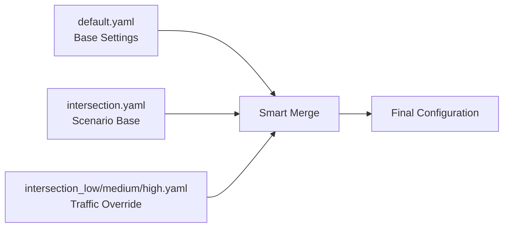

# Traffic Configuration API

The traffic configuration system in OpenCDA-MARL consists of flow-based traffic generation with multiple density levels:

1. **MARLTrafficManager**: Core traffic flow control through flow-based configuration
2. **Multiple Config Files**: Different traffic densities using separate YAML files

```text
Traffic Configuration Architecture
├── MARLTrafficManager       # Reads flows[] from scenario configs
│   ├── Flow-based Generation # Each flow defines rate_vph, strategy, timing
│   ├── Spawn Point Selection # Uses map adapter for spawn/destination pairs
│   └── Dynamic Scheduling   # Poisson arrival process per flow
│
├── Traffic Density Configs  # Different traffic scenarios as separate files
│   ├── intersection_low.yaml    # Low density (safe scenario)
│   ├── intersection_medium.yaml # Medium density (balanced scenario)
│   └── intersection_high.yaml   # High density (aggressive scenario)
│
└── Agent Behavior Params    # Safety/behavior parameters in agent sections
    ├── agents.agent_behavior # General OpenCDA behavior parameters
    ├── agents.vanilla       # VanillaAgent-specific parameters  
    └── agents.rule_based    # RuleBasedAgent-specific parameters
```

## MARLTrafficManager Configuration

=== "Configuration Structure"

    The `MARLTrafficManager` reads traffic configuration from the `scenario.traffic` section, which expects a `flows` array:

    ```yaml
    # configs/marl/intersection.yaml - Actual traffic manager configuration
    scenario:
    traffic:
        # Traffic manager settings
        max_vehicles: 12                    # Maximum concurrent vehicles
        mode: "schedule"                    # schedule | spawn_direct
        excluded_vehicle_types:             # Vehicle types to exclude
        - "motorcycle"
        - "bicycle"
        
        # Flow-based traffic generation
        # NOTE: Flow names are just identifiers - actual spawn locations are determined
        # by the 'strategy' parameter and MARLMapManager spawn point generation
        flows:
        - name: "initial_buildup"          # Flow identifier (name does NOT control spawn location)
            rate_vph: 600                   # Vehicles per hour for this flow
            start_s: 0.0                    # Flow start time (seconds)
            end_s: 120.0                    # Flow end time (seconds)
            strategy: "balanced"            # Spawn strategy: balanced | conflict | random
            spawn_num: 2                    # Vehicles spawned per event
            min_headway_s: 1.5             # Minimum time between vehicles (seconds)
            
        - name: "peak_traffic"
            rate_vph: 500
            start_s: 120.0                  # Staggered start for temporal flow
            end_s: 480.0
            strategy: "balanced"            # This parameter determines spawn distribution
            spawn_num: 2
            min_headway_s: 2.0
            
        - name: "declining_flow" 
            rate_vph: 300                   # Lower rate as traffic declines
            start_s: 480.0
            end_s: 600.0
            strategy: "balanced"            # Equal distribution across ALL spawn points
            spawn_num: 1
            min_headway_s: 3.0
    ```

=== "Flow Parameters"

    | Parameter       | Type   | Description                                                                | Example           |
    | --------------- | ------ | -------------------------------------------------------------------------- | ----------------- |
    | `name`          | string | Flow identifier (does NOT control spawn location)                          | "initial_buildup" |
    | `rate_vph`      | float  | Vehicles per hour generation rate                                          | 600               |
    | `start_s`       | float  | Flow start time in seconds                                                 | 0.0               |
    | `end_s`         | float  | Flow end time in seconds                                                   | 120.0             |
    | `strategy`      | string | Spawn strategy: "balanced", "conflict", "random" (controls spawn location) | "balanced"        |
    | `spawn_num`     | int    | Vehicles spawned per event                                                 | 2                 |
    | `min_headway_s` | float  | Minimum time between spawns                                                | 1.5               |

!!! important "Spawn Location Control"
    **Flow names do NOT control where vehicles spawn**. The actual spawn locations are determined by:
    
    - **`strategy` parameter**: Controls spawn point selection algorithm
    - **MARLMapManager**: Provides available spawn points based on map topology
    - **Junction approach detection**: Automatically identifies intersection entry points
    
    Available strategies:
    - `"balanced"`: Equal distribution across all available spawn points
    - `"conflict"`: Prioritize conflicting movements for stress testing
    - `"random"`: Random selection from available spawn points

## Configuration Inheritance System

OpenCDA-MARL uses a **three-layer configuration inheritance system** with smart merging, following the same approach as `opencda.py`:



**Configuration Loading Flow**:
1. **default.yaml**: Base OpenCDA + MARL settings (agents, vehicle, world, etc.)
2. **intersection.yaml**: Intersection-specific settings (map, spectator, base traffic)
3. **intersection_[density].yaml**: Traffic density overrides + agent parameter tuning
4. **smart_merge**: Combines all three using intelligent merging

## Traffic Density Configuration Files (Override-Only)

The density config files contain **only parameters that override** the base configuration. This approach provides:

- **Maintainability**: No duplicate configuration
- **Flexibility**: Easy to tune agent parameters per scenario
- **Consistency**: All scenarios use same base settings except traffic flows

=== "Low Density (Safe Scenario)"

    **File**: `configs/marl/intersection_low.yaml` (**Override-Only**)
    
    ```yaml
    # MARL Configuration Override for LOW TRAFFIC DENSITY
    # This config only contains parameters that override default.yaml + intersection.yaml
    
    description: |-
      Low traffic density scenario with conservative agent parameters
    
    # Override scenario name and traffic flows
    scenario:
      name: "intersection_low"
      simulation:
        max_steps: 1200  # Quick test duration
      traffic:
        flows:
          - name: initial_buildup
            rate_vph: 300    # Conservative buildup
            start_s: 0
            end_s: 120
            strategy: balanced
            spawn_num: 1
            min_headway_s: 2.5  # Conservative spacing
            
          - name: peak_traffic
            rate_vph: 200    # Low sustained rate
            start_s: 120
            end_s: 480
            strategy: balanced
            spawn_num: 1
            min_headway_s: 3.5  # Longer spacing
            
          - name: declining_flow
            rate_vph: 150    # Very low rate
            start_s: 480
            end_s: 600
            strategy: balanced
            spawn_num: 1
            min_headway_s: 4.0  # Longest spacing
    
    # Override benchmark configuration
    benchmark:
      mode: "live"
      file_path: "benchmarks/intersection_low_baseline_10min.json"
    
    # Agent parameter tuning for low traffic
    agents:
      vanilla:
        intersection_safety_multiplier: 1.5  # Less aggressive than default (2.0)
        min_safety_distance: 6.0  # Reduced from default (8.0)
      
      rule_based:
        cautious_speed: 25.0  # Faster than default (20.0) - safe in low traffic
        junction_approach_distance: 60.0  # Shorter than default (70.0)
    ```

=== "Medium Density (Balanced Scenario)"

    **File**: `configs/marl/intersection_medium.yaml` (**Override-Only**)
    
    ```yaml
    # MARL Configuration Override for MEDIUM TRAFFIC DENSITY
    # This config only contains parameters that override default.yaml + intersection.yaml
    
    description: |-
      Medium traffic density scenario using default agent parameters
    
    # Override scenario name and traffic flows
    scenario:
      name: "intersection_medium"
      simulation:
        max_steps: 1200
      traffic:
        flows:
          - name: initial_buildup
            rate_vph: 500    # Medium-high initial rate
            start_s: 0
            end_s: 120
            strategy: balanced
            spawn_num: 2
            min_headway_s: 1.8  # Medium spacing
            
          - name: peak_traffic
            rate_vph: 400    # Balanced sustained rate
            start_s: 120
            end_s: 480
            strategy: balanced
            spawn_num: 1
            min_headway_s: 2.0  # Standard spacing
            
          - name: declining_flow
            rate_vph: 250    # Moderate decline rate
            start_s: 480
            end_s: 600
            strategy: balanced
            spawn_num: 1
            min_headway_s: 3.0  # Longer spacing
    
    # Override benchmark configuration
    benchmark:
      mode: "live"
      file_path: "benchmarks/intersection_medium_baseline_10min.json"
    
    # Agent parameters - use defaults from intersection.yaml (no overrides needed)
    # Can be customized based on testing results:
    # agents:
    #   vanilla:
    #     intersection_safety_multiplier: 2.0  # Default from intersection.yaml
    #   rule_based:
    #     cautious_speed: 20.0  # Default from default.yaml
    ```

=== "High Density (Aggressive Scenario)"

    **File**: `configs/marl/intersection_high.yaml` (**Override-Only**)
    
    ```yaml
    # MARL Configuration Override for HIGH TRAFFIC DENSITY
    # This config only contains parameters that override default.yaml + intersection.yaml
    
    description: |-
      High traffic density scenario with defensive agent parameters
    
    # Override scenario name and traffic flows
    scenario:
      name: "intersection_high"
      simulation:
        max_steps: 1200
      traffic:
        flows:
          - name: initial_buildup
            rate_vph: 800    # Aggressive initial rate
            start_s: 0
            end_s: 120
            strategy: balanced
            spawn_num: 2
            min_headway_s: 1.0  # Very short spacing
            
          - name: peak_traffic
            rate_vph: 600    # High sustained rate
            start_s: 120
            end_s: 480
            strategy: balanced
            spawn_num: 2
            min_headway_s: 1.5  # Short spacing
            
          - name: declining_flow
            rate_vph: 400    # Still high decline rate
            start_s: 480
            end_s: 600
            strategy: balanced
            spawn_num: 1
            min_headway_s: 2.0  # Slightly longer spacing
    
    # Override benchmark configuration
    benchmark:
      mode: "live"
      file_path: "benchmarks/intersection_high_baseline_10min.json"
    
    # Agent parameter tuning for high traffic (more defensive)
    agents:
      vanilla:
        intersection_safety_multiplier: 2.5  # More conservative than default (2.0)
        min_safety_distance: 10.0  # Larger than default (8.0)
        lateral_safety_margin: 4.0  # Larger than default (3.0)
        prediction_horizon: 4.0  # Longer than default (3.0)
      
      rule_based:
        cautious_speed: 15.0  # Slower than default (20.0) due to congestion
        junction_approach_distance: 80.0  # Longer than default (70.0)
        time_headway: 2.5  # Longer than default (2.0) for safety
        minimum_distance_buffer: 7.0  # Larger than default (5.0)
    ```

!!! important "Configuration Inheritance Benefits"
    - **Consistency**: All scenarios use the same base vehicle, sensor, and world settings
    - **Maintainability**: Only traffic flows and agent-specific tuning need to be specified
    - **Flexibility**: Easy to adjust agent parameters for optimal performance in each scenario
    - **No Duplication**: Base settings defined once in default.yaml and intersection.yaml

## API Reference

=== "MARLTrafficManager Class"

    ```python
    # opencda_marl/core/world/traffic_manager.py
    class MARLTrafficManager:
        """
        Flow-based traffic generation for MARL scenarios.
        
        Features:
        - Multiple traffic flows with independent rates
        - Poisson arrival process per flow
        - Map adapter integration for spawn points
        - Benchmark integration for record/replay
        """
        
        def __init__(self, world: carla.World, traffic_cfg: Dict, state: Dict):
            """
            Initialize traffic manager.

            Parameters
            ----------
            world : carla.World
                CARLA world instance
            traffic_cfg : dict
                Traffic configuration with 'flows' array
            world : carla.World
                CARLA world instance
            """
    ```

=== "Core Methods"

    === "Traffic Control"

        ```python
        def update(self, step_count: int) -> None:
            """
            Update traffic generation for current simulation step.
            
            Processes all active flows and generates spawn events
            based on Poisson arrival process.
            """
            
        def get_scheduled_spawns(self) -> List[Dict[str, Any]]:
            """
            Get and consume spawn events for this step.
            
            Returns list of spawn events for AgentManager to process.
            Each event contains vehicle_id, transform, destination, blueprint.
            """
            
        def reschedule_failed_spawn(self, event: Dict[str, Any]) -> None:
            """
            Reschedule failed spawn attempt for next step.
            
            Called by AgentManager when spawn location is blocked.
            """
        ```

    === "Flow Management"

        ```python
        def add_immediate_spawn(self, transform: carla.Transform, 
                            vehicle_id: str = None,
                            destination: carla.Location = None) -> bool:
            """
            Add immediate spawn event to queue.
            
            Bypasses normal flow scheduling for manual spawning.
            """
            
        def pause_spawning(self) -> None:
            """Pause all traffic flow generation."""
            
        def resume_spawning(self) -> None:
            """Resume traffic flow generation."""
        ```

    === "Information Access"

        ```python
        def get_traffic_info(self) -> Dict[str, Any]:
            """
            Get current traffic flow statistics.
            
            Returns
            -------
            dict
                Statistics including:
                - paused: Whether spawning is paused
                - queue_len: Current spawn queue length
                - flows: Per-flow status and rates
                - active_vehicles: Number of background vehicles
            """
        ```

=== "Benchmark Integration Workflow"

    The benchmark comparison system uses smart_merge configuration loading (same approach as opencda.py):

    ```mermaid
    graph TD
        A[test_benchmark_comparison.py] --> B[Load Base Configs]
        B --> C[Load default.yaml]
        B --> D[Load intersection.yaml] 
        B --> E[Load density override<br/>intersection_low/medium/high.yaml]
        C --> F[smart_merge]
        D --> F
        E --> F
        F --> G[Update agent_type]
        G --> H[Run: python opencda.py -t scenario_name --marl]
        H --> I[opencda.py loads same configs<br/>using smart_merge]
        I --> J[MARLTrafficManager reads<br/>merged flows from config]
        J --> K[Parse results]
        
        A --> L[Select Density]
        L --> M[intersection_low.yaml for 'safe']
        L --> N[intersection_medium.yaml for 'balanced'] 
        L --> O[intersection_high.yaml for 'aggressive']
    ```

=== "Benchmark Configuration Mapping"

    ```python
    # test/marl/test_benchmark_comparison.py - Updated to use smart_merge
    density_configs = {
        'safe': {
            'scenario_name': 'intersection_low',  # Scenario name for opencda.py
            'description': 'Low traffic density using intersection_low.yaml overrides',
            'override_config': 'intersection_low.yaml'  # Override config file
        },
        'balanced': {
            'scenario_name': 'intersection_medium',
            'description': 'Medium traffic density using intersection_medium.yaml overrides',
            'override_config': 'intersection_medium.yaml'
        },
        'aggressive': {
            'scenario_name': 'intersection_high', 
            'description': 'High traffic density using intersection_high.yaml overrides',
            'override_config': 'intersection_high.yaml'
        }
    }
    
    # Configuration loading process (same as opencda.py):
    def load_test_configuration(scenario):
        """Load configuration using smart_merge approach."""
        # Step 1: Load base configurations
        default_dict = OmegaConf.load('configs/marl/default.yaml')
        intersection_dict = OmegaConf.load('configs/marl/intersection.yaml')
        override_dict = OmegaConf.load(f'configs/marl/{scenario["override_config"]}')
        
        # Step 2: Smart merge (same as opencda.py)
        base_config = smart_merge(default_dict, intersection_dict)
        final_config = smart_merge(base_config, override_dict)
        
        return final_config
    ```

## Usage Examples

=== "Agent Parameter Tuning for Different Scenarios"

    The override-only config system allows easy agent parameter tuning per traffic density:

    ```yaml
    # configs/marl/intersection_custom.yaml - Custom tuning example
    description: |-
      Custom intersection scenario with tuned agent parameters
    
    scenario:
      name: "intersection_custom"
      traffic:
        flows:
          - name: initial_buildup
            rate_vph: 450  # Custom traffic rate
            start_s: 0
            end_s: 120
            strategy: balanced
            spawn_num: 2
            min_headway_s: 1.6
    
    # Custom agent parameter tuning
    agents:
      vanilla:
        # Adjust intersection behavior
        intersection_safety_multiplier: 1.8  # Custom safety level
        min_safety_distance: 7.0
        lateral_safety_margin: 3.5
        prediction_horizon: 3.5
        
        # Vehicle-specific tuning
        intersection_detection_distance: 45.0
        multi_vehicle_ttc: true
        max_vehicles_to_track: 6
      
      rule_based:
        # Junction management tuning
        junction_approach_distance: 65.0  # Custom approach distance
        junction_conflict_distance: 45.0
        cautious_speed: 22.0  # Custom cautious speed
        
        # Car following tuning
        time_headway: 2.2  # Custom following distance
        following_gain: 0.6
        minimum_distance_buffer: 6.0
        
        # Speed management
        max_speed: 32  # Custom max speed for scenario
    
    # Also override general behavior parameters
    agents:
      agent_behavior:
        safety_time: 3.2  # Custom TTC threshold
        emergency_param: 0.5  # Custom emergency threshold
        max_speed: 32  # Scenario-specific speed limit
    ```

=== "Benchmark Testing Workflow"

    ```python
    # Example: Running benchmark comparison with tuned parameters
    
    # Step 1: Create custom scenario config
    custom_config = {
        'scenario_name': 'intersection_custom',
        'override_config': 'intersection_custom.yaml'
    }
    
    # Step 2: Test different agent types with custom parameters
    from test.marl.test_benchmark_comparison import BenchmarkComparator
    
    comparator = BenchmarkComparator()
    
    # Test vanilla agent with custom tuning
    result_vanilla = comparator.run_single_test('vanilla', 'custom')
    
    # Test rule_based agent with custom tuning
    result_rule = comparator.run_single_test('rule_based', 'custom')
    
    # Compare results and tune parameters iteratively
    if result_vanilla['collision_rate'] > 10:
        # Increase safety parameters in intersection_custom.yaml
        # vanilla.intersection_safety_multiplier: 2.2
        # vanilla.min_safety_distance: 9.0
        pass
    ```

=== "Performance Optimization Guidelines"

    **Traffic Flow Tuning**:
    ```yaml
    # For high throughput (target: >35 vpm)
    traffic:
      flows:
        - rate_vph: 600
          min_headway_s: 1.5  # Shorter spacing
          spawn_num: 2        # More vehicles per event
    
    # For safety focus (target: <5% collisions)
    agents:
      vanilla:
        intersection_safety_multiplier: 3.0  # Very conservative
        min_safety_distance: 12.0
      rule_based:
        time_headway: 3.0  # Longer following distance
        cautious_speed: 15.0  # Very cautious speed
    ```

    **Agent Behavior Tuning Based on Results**:
    ```yaml
    # If throughput too low (<25 vpm):
    agents:
      agent_behavior:
        safety_time: 2.5      # Reduce from 3.0
        max_speed: 40         # Increase from 35
      vanilla:
        intersection_safety_multiplier: 1.5  # Less conservative
    
    # If collision rate too high (>15%):
    agents:
      agent_behavior:
        safety_time: 4.0      # Increase from 3.0
        emergency_param: 0.6   # More sensitive
      rule_based:
        junction_approach_distance: 90.0  # Longer approach
        cautious_speed: 12.0   # Very slow when conflicts detected
    ```

=== "Runtime Traffic Monitoring"

    ```python
    # Monitor traffic flow and agent performance during simulation
    def monitor_scenario_performance(traffic_manager, agent_manager):
        # Traffic flow statistics
        traffic_info = traffic_manager.get_traffic_info()
        print(f"Active vehicles: {traffic_info['active_vehicles']}")
        print(f"Spawn queue: {traffic_info['queue_len']}")
        
        for flow_name, flow_info in traffic_info['flows'].items():
            print(f"Flow {flow_name}:")
            print(f"  Rate: {flow_info['rate_vph_eff']:.0f} vph")
            print(f"  Next spawn: {flow_info['next_arrival_s']:.1f}s")
        
        # Agent performance metrics
        agent_stats = agent_manager.get_performance_stats()
        print(f"Total agents: {len(agent_stats)}")
        print(f"Average speed: {sum(s['speed'] for s in agent_stats)/len(agent_stats):.1f} km/h")
        
        # Safety metrics
        collision_count = sum(1 for s in agent_stats if s.get('collision_detected', False))
        print(f"Collision rate: {collision_count/len(agent_stats)*100:.1f}%")
    ```

## Performance Tuning Guidelines

=== "Flow Rate Optimization"

    | Traffic Density | Total VPH | Per-Flow Rate | Min Headway | Expected Throughput |
    | --------------- | --------- | ------------- | ----------- | ------------------- |
    | **Light**       | 800       | 200           | 3.0s        | 25-30 VPM           |
    | **Medium**      | 1600      | 400           | 2.0s        | 35-40 VPM           |
    | **Heavy**       | 2400      | 600           | 1.5s        | 40-45 VPM           |
    | **Extreme**     | 3200      | 800           | 1.0s        | 45-50 VPM           |

=== "Low Throughput"

    **Problem**: Throughput < 30 VPM
    
    **Solutions**:
    ```yaml
    flows:
      - rate_vph: 500              # Increase from 300
        min_headway_s: 1.8         # Reduce from 2.5
        spawn_num: 2               # Increase from 1
    ```

=== "High Collision Rate"

    **Problem**: Collisions > 15%
    
    **Solutions**:
    ```yaml
    # In agent_behavior section
    agents:
      agent_behavior:
        safety_time: 3.5           # Increase from 2.5
        emergency_param: 0.8       # Increase from 0.4
        
      vanilla:
        intersection_safety_multiplier: 3.0  # Increase caution
    ```

=== "Spawn Failures"

    **Problem**: Vehicles not appearing
    
    **Solutions**:
    ```yaml
    traffic:
      max_vehicles: 15             # Increase limit
    flows:
      - min_headway_s: 3.0         # Increase spacing
        rate_vph: 350              # Reduce rate
    ```

---

**MARLTrafficManager** (`opencda_marl/core/world/traffic_manager.py`)  
**Benchmark Testing** (`test/marl/test_benchmark_comparison.py`)  
**Flow-based** (`configs/marl/intersection.yaml`)