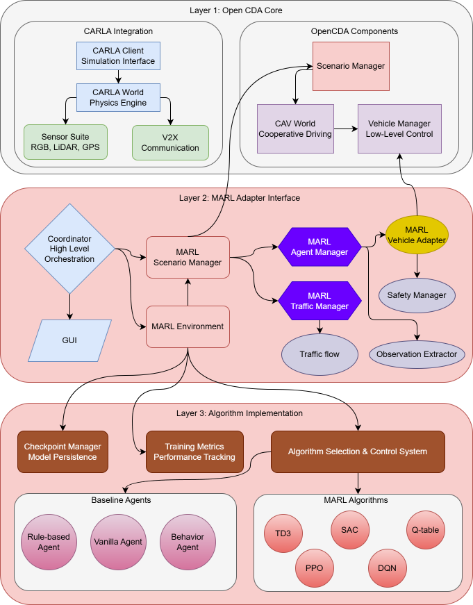

# OpenCDA-MARL

Welcome to OpenCDA-MARL, an advanced framework that integrates Multi-Agent Reinforcement Learning (MARL) capabilities with the OpenCDA autonomous driving simulation platform.

## 🎯 Overview

This project extends the OpenCDA framework to support MARL algorithms for cooperative autonomous driving scenarios. It enables researchers to:

- Train cooperative autonomous vehicles using state-of-the-art MARL algorithms
- Evaluate multi-agent policies in realistic driving scenarios
- Develop and test coordination strategies for autonomous vehicle fleets


## 🚀 Quick Start

```bash
# Clone and setup
git clone https://github.com/radar-lab/opencda-marl.git
cd opencda-marl

# Install dependencies with pixi
pixi install

# Run a quick test
pixi run marl-quick-test
```

Refer to [Quick Start](quick-start.md) for more details.

## 📚 Key Features

#### MARL Integration

- **Multi-Agent Training**: Support for various MARL algorithms (MAPPO, MADDPG, etc.)
- **Cooperative Scenarios**: Platooning, intersection coordination, lane merging
- **Scalable Architecture**: Handle large numbers of cooperative agents

#### Research-Friendly

- **Modular Design**: Easy to extend and customize for research needs
- **Experiment Tracking**: Built-in logging and evaluation metrics
- **Visualization**: Real-time monitoring and post-hoc analysis tools

#### OpenCDA Foundation

- **Realistic Simulation**: Built on CARLA simulator with realistic physics
- **Comprehensive Modules**: Perception, planning, control, and communication
- **Scenario Testing**: Extensive testing framework for autonomous driving scenarios

For comprehensive OpenCDA documentation, refer to [OpenCDA Documentation](https://opencda-documentation.readthedocs.io/en/latest/). The original documentation covers:

- Complete installation instructions
- Core system architecture and design
- Scenario configuration and testing
- Full API references for all OpenCDA modules
- Advanced tutorials and customization guides

## 🏗️ Architecture



## 📖 Documentation

**MARL-Specific Documentation**: Refer to [MARL Overview](api/opencda-marl/overview.md) for more details.

1. **[Installation](installation.md)** - Set up your development environment
2. **[Quick Start](quick-start.md)** - Run your first MARL experiment
3. **[MARL Framework](marl/architecture.md)** - Understand the MARL integration
4. **[API Reference](api/opencda-marl/overview.md)** - Detailed API documentation

## 🤝 Contributing

This project is currently under active development. Please see our [Contributing Guide](contributing.md) for information on how to contribute.

## 📄 License

This project is licensed under the same terms as OpenCDA. See [LICENSE](LICENSE) for details.

## 🙏 Acknowledgments

- Supported by the [Radar Lab](https://github.com/radar-lab) at University of Arizona.
- Built upon the excellent [OpenCDA](https://github.com/ucla-mobility/OpenCDA) framework by UCLA Mobility Lab.
- Carla simulator provided by [CARLA](https://carla.org/).
- SUMO simulator provided by [SUMO](https://eclipse.dev/sumo/).
- [Pixi](https://github.com/pixi-tools/pixi) is a powerful tool for managing Python dependencies.
