# OpenCDA-MARL Architecture

OpenCDA-MARL extends the original OpenCDA framework to support Multi-Agent Reinforcement Learning (MARL) for cooperative autonomous driving. This document describes the high-level architecture design and integration rationale.

## Design Philosophy

The architecture separates concerns to maintain backward compatibility while enabling MARL capabilities:

1. **Preservation Principle**: OpenCDA's proven autonomous driving stack remains untouched
2. **Extension Principle**: MARL functionality is added as a non-invasive layer
3. **Flexibility Principle**: Components can be mixed and matched based on requirements

| Decision                | Rationale                        | Trade-off                      |
| ----------------------- | -------------------------------- | ------------------------------ |
| **Adapter Pattern**     | Avoids modifying OpenCDA core    | Slight performance overhead    |
| **Registry-First Maps** | Predictable map loading behavior | Manual registration required   |
| **Gym Compatibility**   | Standard RL interface            | Some OpenCDA complexity hidden |
| **Loose Coupling**      | Independent development/testing  | More integration complexity    |

## Directory Structure

This is the directory structure of the OpenCDA-MARL project.

<details>
<summary>Directory Structure</summary>
```sh
OpenCDA-MARL/
├── docs/                       # Documentation
├── opencda/                    # Original OpenCDA core (preserved)
│   ├── assets/                 # Maps and resources
│   ├── co_simulation/          # SUMO integration
│   ├── core/                   # Core modules
│   │   ├── actuation/          # Control algorithms
│   │   ├── application/        # Cooperative driving apps
│   │   ├── common/             # Base classes and V2X
│   │   ├── map/                # HD Map management
│   │   ├── plan/               # Planning algorithms
│   │   └── sensing/            # Perception and localization
│   ├── customize/              # User customizations
│   └── scenario_testing/       # Scenario scripts and configs
│
├── opencda_marl/               # MARL extensions (implemented)
│   ├── core/                   # Core MARL components
│   │   ├── coordinator.py      # Main MARL orchestrator ✅
│   │   ├── agent_manager.py    # Multi-agent coordination ✅
│   │   ├── marl_environment.py # Custom MARL environment ✅
│   │   ├── adapters/           # OpenCDA integration adapters
│   │   │   ├── vehicle_adapter.py     # Vehicle-agent bridge ✅
│   │   │   ├── map_adapter.py         # Map integration adapter ✅
│   │   │   └── config_defaults.py     # Default configurations ✅
│   │   ├── agents/             # Implemented baseline agents
│   │   │   ├── agent_factory.py       # Agent factory ✅
│   │   │   ├── marl_agent.py         # Base MARL agent ✅
│   │   │   ├── vanilla_agent.py      # Enhanced safety agent ✅
│   │   │   └── rule_based_agent.py   # 3-stage rules agent ✅
│   │   ├── benchmark/          # Benchmark testing system
│   │   │   ├── benchmark_player.py   # Agent execution ✅
│   │   │   ├── benchmark_recorder.py # Results recording ✅
│   │   │   ├── evaluation_metrics.py # Performance metrics ✅
│   │   │   ├── traffic_benchmark.py  # Traffic scenarios ✅
│   │   │   └── traffic_monitor.py    # Real-time monitoring ✅
│   │   ├── safety/             # Safety management
│   │   │   ├── marl_collision_sensor.py # Collision detection ✅
│   │   │   └── marl_safety_manager.py   # Safety coordination ✅
│   │   └── world/              # World management
│   │       ├── map_manager.py         # Custom map loading ✅
│   │       ├── spectator_manager.py   # Camera control ✅
│   │       ├── traffic_manager.py     # Traffic coordination ✅
│   │       └── registry.py            # Component registry ✅
│   │
│   ├── scenarios/              # MARL scenario management
│   │   └── scenario_manager.py # Enhanced ScenarioManager ✅
│   │
│   ├── assets/                 # MARL-specific assets
│       ├── maps/               # Custom intersection maps ✅
│       │   ├── intersection.xodr      # Intersection map file
│       │   └── intersection.fbx       # Intersection 3D model
│       └── configs/            # Configuration templates ✅
│
├── configs/                    # NEW: Unified configuration
│   ├── opencda/                # Original OpenCDA configs
│   └── marl/                   # MARL-specific configs
│
└── scripts/                    # Installation and setup scripts
```
</details>

## System Architecture

### Current Implementation

The OpenCDA-MARL integration follows a custom environment architecture that provides direct CARLA integration without Gym complexity. The **MARLCoordinator** orchestrates all components, managing both the **MARLScenarioManager** (which owns CARLA) and the **Custom MARL Environment** (which provides training capabilities). **MARLVehicleAdapters** bridge individual vehicles with multiple controller types including baseline agents (behavior, vanilla, rule_based) and planned RL agents. The OpenCDA Core Layer remains unchanged, with all subsystems preserved exactly as designed.

### Key Architectural Changes

✅ **Custom MARL Environment**: Replaced Gym wrapper with direct CARLA integration  
✅ **Baseline Agent Suite**: Three implemented agent types for benchmarking  
✅ **Benchmark System**: Automated testing across different traffic scenarios  
✅ **Traffic Scenario Presets**: Standardized configurations (safe, balanced, aggressive)  
✅ **Enhanced Agent Management**: Dynamic spawning with collision handling  

```mermaid
graph TB
    subgraph "MARL Orchestration Layer"
        A[MARLCoordinator<br/>Main Orchestrator] --> B[OmegaConf Config<br/>Direct YAML Access]
        A --> C[ExecutionMode<br/>GUI/Train/Eval/CLI]
    end
    
    subgraph "Custom Environment Layer"  
        D[MARLEnvironment<br/>Custom RL Environment] --> E[MARLTrainer<br/>Training/Evaluation]
        D --> F[Observation System<br/>Direct Vehicle Access]
        D --> G[Reward Calculation<br/>Multi-objective]
        D --> H[Termination Logic<br/>Collision/Completion]
    end
    
    subgraph "Agent Management Layer"
        I[MARLAgentManager<br/>Multi-agent Coordination] --> J[BehaviorAgent<br/>OpenCDA Standard]
        I --> K[VanillaAgent<br/>Enhanced Safety]
        I --> L[RuleBasedAgent<br/>3-stage Rules]
        I --> M[RL Agents<br/>PPO/SAC/TD3 - Planned]
    end
    
    subgraph "Vehicle Adapter Layer"
        N[MARLVehicleAdapter<br/>Vehicle-Agent Bridge] --> O[External Speed Control<br/>RL Actions → Speed]
        N --> P[Controller Switching<br/>Multiple Agent Types]
        N --> Q[Collision Detection<br/>Instant Destruction]
        N --> R[Observation Extraction<br/>Vehicle State → RL]
    end
    
    subgraph "Enhanced OpenCDA Layer"
        S[MARLScenarioManager<br/>extends ScenarioManager] --> T[VehicleManager<br/>Individual Vehicle]
        T --> U[PerceptionManager<br/>Sensors]
        T --> V[LocalPlannerBehavior<br/>Path Planning] 
        T --> W[ControlManager<br/>Vehicle Control]
        T --> X[V2XManager<br/>Communication]
        Y[CavWorld<br/>Multi-Vehicle Coord]
        Z[SpectatorManager<br/>Camera Control]
    end
    
    subgraph "CARLA Simulation"
        AA[CARLA Server] --> BB[Physics Engine]
        AA --> CC[Sensor Simulation] 
        AA --> DD[Map Rendering<br/>XODR + FBX]
    end
    
    subgraph "Benchmark System"
        EE[BenchmarkComparator<br/>Automated Testing] --> FF[Traffic Scenarios<br/>Safe/Balanced/Aggressive]
        EE --> GG[Performance Metrics<br/>VPM/Success/Collision]
        EE --> HH[Results Export<br/>JSON/Visualization]
    end
    
    %% Key Relationships - Coordinator manages everything
    A --> D
    A --> S
    A --> I
    
    %% Custom Environment wraps ScenarioManager
    D --> S
    
    %% Agent Manager coordinates vehicle adapters
    I --> N
    
    %% Vehicle Adapters wrap VehicleManagers
    N --> T
    
    %% ScenarioManager owns CARLA stepping
    S --> AA
    S --> Y
    S --> Z
    
    %% Benchmark system uses coordinator
    EE --> A
    
    %% OpenCDA internal relationships (unchanged)
    Y --> T
    U --> CC
    T --> BB
    
    %% Styling
    classDef coordLayer fill:#e3f2fd
    classDef environmentLayer fill:#f3e5f5
    classDef agentLayer fill:#fff8e1
    classDef adapterLayer fill:#fff3e0
    classDef opencdaLayer fill:#e8f5e8
    classDef carlaLayer fill:#fafafa
    classDef benchmarkLayer fill:#f9fbe7
    
    class A,B,C coordLayer
    class D,E,F,G,H environmentLayer
    class I,J,K,L,M agentLayer
    class N,O,P,Q,R adapterLayer
    class S,T,U,V,W,X,Y,Z opencdaLayer
    class AA,BB,CC,DD carlaLayer
    class EE,FF,GG,HH benchmarkLayer
```



## Core Components

=== "Current Implementation Status"

    ### ✅ Implemented Components

    #### Custom MARL Environment Layer
    - **MARLEnvironment**: Direct CARLA integration without Gym complexity
    - **MARLTrainer**: Training and evaluation workflows
    - **Observation System**: Direct vehicle state access with 10D observation vectors
    - **Reward Calculation**: Multi-objective reward function (progress, safety, efficiency)

    #### Baseline Agent Suite  
    - **BehaviorAgent**: OpenCDA standard autonomous driving
    - **VanillaAgent**: Enhanced collision avoidance with multi-vehicle TTC tracking
    - **RuleBasedAgent**: 3-stage intersection rules (approach, follow, cruise)
    - **Agent Factory**: Dynamic agent creation based on configuration

    #### Benchmark Testing Infrastructure
    - **BenchmarkComparator**: Automated testing across agents and scenarios
    - **Traffic Scenario Presets**: Safe (~5%), balanced (~10%), aggressive (~20%) collision rates
    - **Performance Metrics**: Throughput (VPM), success rate, collision rate
    - **Results Export**: JSON format with visualization capabilities

    #### Vehicle Adapter System
    - **MARLVehicleAdapter**: Bridges OpenCDA VehicleManager with multi-agent control
    - **External Speed Control**: Target speed actions for RL agents
    - **Controller Switching**: Support for multiple agent types
    - **Collision Handling**: Instant destruction for clean experiments

    #### Scenario Management
    - **MARLScenarioManager**: Enhanced scenario management with MARL capabilities
    - **MARLAgentManager**: Multi-agent coordination and lifecycle management
    - **Dynamic Vehicle Spawning**: Queue-based spawning with junction awareness
    - **Traffic Management**: Integration with CARLA traffic manager

    ### 🚧 In Development (Phase 3)
    - **MARL Agent Policies**: PPO, SAC, TD3 implementations (stub policies exist)
    - **Advanced Reward Functions**: Cooperative reward shaping
    - **Model Persistence**: Checkpointing and model loading

    ### 📋 Planned (Phase 4)
    - **Training Framework Integration**: Stable Baselines3, RLlib support
    - **Distributed Training**: Multi-GPU and multi-node capabilities
    - **Advanced Scenarios**: Highway merging, platoon control

=== "Configuration Pattern"

    The configuration system uses OmegaConf for direct YAML merging without additional layers:

    ```python
    # opencda.py - Simple configuration loading
    if opt.marl:
        default_yaml = "configs/marl/default.yaml"
        config_yaml = f"configs/marl/{opt.test_scenario}.yaml"
    else:
        default_yaml = "configs/opencda/default.yaml"  
        config_yaml = f"configs/opencda/{opt.test_scenario}.yaml"
    
    # Direct OmegaConf merge - no ConfigurationManager needed
    config = OmegaConf.merge(
        OmegaConf.load(default_yaml),
        OmegaConf.load(config_yaml)
    )
    ```


## Execution Flow

OpenCDA-MARL extends the original `opencda.py` entry point with MARL capabilities through command-line flags:

=== "Execution Flow"

    #### Standard OpenCDA Execution
    ```bash
    # Original OpenCDA functionality (unchanged)
    python opencda.py -t single_2lanefree_carla
    pixi run cda-quick-test
    ```

    #### MARL-Enhanced Execution

    ```bash
    # Basic MARL mode - coordinator manages scenario
    python opencda.py -t single_town06_carla --marl

    # MARL with GUI debugging
    python opencda.py -t intersection_4way --marl --gui

    # MARL training mode
    python opencda.py -t highway_merging --marl --train --episodes 1000

    # MARL evaluation with trained model
    python opencda.py -t intersection_4way --marl --eval --checkpoint model.pkl
    ```

    #### Pixi Task Integration

    ```bash
    # Quick MARL test
    pixi run marl-quick-test

    # MARL training
    pixi run marl-train --config intersection.yaml

    # MARL GUI debugging
    pixi run marl-gui-debug --config intersection.yaml
    ```

=== "MARL Execution Flow"

    When `--marl` flag is detected, the execution follows this flow:

    1. **Configuration Loading**: Direct OmegaConf merge of YAML files
    2. **MARLCoordinator**: Create main orchestrator with merged config
    3. **ScenarioManager**: Initialize CARLA world and vehicle spawning
    4. **AgentManager**: Setup RL agents and algorithms
    5. **VehicleAdapters**: Bridge vehicles with RL interface
    6. **Execution Mode**: Start GUI, training, or evaluation
   
    ```mermaid
    graph TD
        A[opencda.py --marl] --> B{Check MARL flag}
        B -->|Yes| C[Load MARL Configuration]
        B -->|No| D[Standard OpenCDA Execution]
        
        C --> E[Create MARLCoordinator]
        E --> F[Initialize Components]
        F --> G[Create ScenarioManager]
        F --> H[Create AgentManager]
        F --> I[Setup VehicleAdapters]
        
        G --> J{Execution Mode}
        J -->|gui| K[GUI Debug Mode]
        J -->|train| L[Training Mode]
        J -->|eval| M[Evaluation Mode]
        J -->|default| N[Interactive CLI]
        
        K --> O[Step-by-step Control]
        L --> P[Automated Training Loop]
        M --> Q[Policy Evaluation]
        N --> R[Manual Commands]
    ```