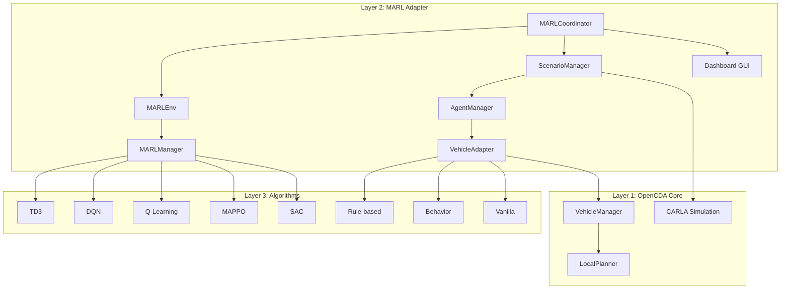
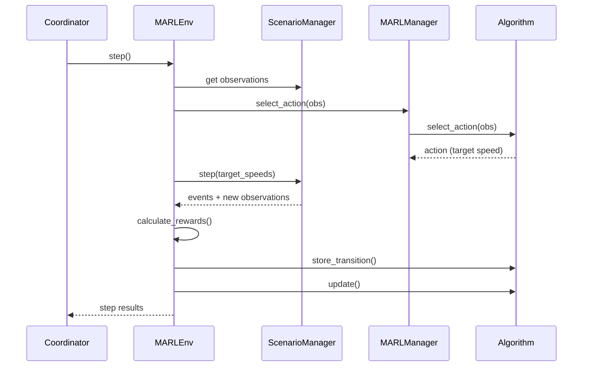

# OpenCDA-MARL Architecture

OpenCDA-MARL extends the original OpenCDA framework to support Multi-Agent Reinforcement Learning (MARL) for cooperative autonomous driving. This document describes the current architecture implementation.

!!! success "Release Status"
    OpenCDA-MARL v1.0.0 is the first stable release. The system supports intersection scenarios with multiple agent types and five RL algorithms (TD3, DQN, Q-Learning, MAPPO, SAC). Both CARLA and SUMO simulators are supported.

## Directory Structure

<details>
<summary>Directory Structure</summary>
```sh
OpenCDA-MARL/
├── docs/                       # Documentation
├── opencda/                    # Original OpenCDA core (preserved)
│   ├── assets/                 # Maps and resources
│   ├── co_simulation/          # SUMO integration
│   ├── core/                   # Core modules
│   │   ├── actuation/          # Control algorithms
│   │   ├── application/        # Cooperative driving apps
│   │   ├── common/             # Base classes and V2X
│   │   ├── map/                # HD Map management
│   │   ├── plan/               # Planning algorithms
│   │   └── sensing/            # Perception and localization
│   ├── customize/              # User customizations
│   └── scenario_testing/       # Scenario scripts and configs
│
├── opencda_marl/               # MARL extensions
│   ├── coordinator.py          # Main MARL orchestrator
│   ├── core/                   # Core MARL components
│   │   ├── agent_manager.py    # Vehicle spawning & adapter management
│   │   ├── events.py           # StepEvent dataclass
│   │   ├── world_reset_manager.py  # CARLA memory management
│   │   ├── adapter/            # Vehicle control abstraction
│   │   │   ├── vehicle_adapter.py   # MARL vehicle wrapper
│   │   │   ├── vehicle_defaults.py  # Default configs
│   │   │   └── exception.py         # Custom exceptions
│   │   ├── agents/             # Agent implementations
│   │   │   ├── agent_factory.py     # Agent factory pattern
│   │   │   ├── basic_agent.py       # Base autonomous agent
│   │   │   ├── marl_agent.py        # RL-controlled agent
│   │   │   ├── marl_behavior_agent.py # Behavior agent
│   │   │   ├── vanilla_agent.py     # Safety agent
│   │   │   └── rule_based_agent.py  # Rule-based agent
│   │   ├── marl/               # MARL algorithms & infrastructure
│   │   │   ├── marl_manager.py      # Algorithm orchestrator
│   │   │   ├── extractor.py         # Observation feature extraction
│   │   │   ├── metrics.py           # Training metrics tracking
│   │   │   ├── checkpoint.py        # Model checkpoint management
│   │   │   └── algorithms/          # RL implementations
│   │   │       ├── base_algorithm.py    # Abstract base class
│   │   │       ├── q_learning.py        # Q-Learning
│   │   │       ├── dqn.py              # Deep Q-Network
│   │   │       ├── td3.py              # Twin Delayed DDPG
│   │   │       ├── mappo.py            # Multi-Agent PPO
│   │   │       ├── sac.py              # Soft Actor-Critic
│   │   │       ├── rollout_buffer.py   # MAPPO rollout buffer
│   │   │       └── smart_replay_buffer.py # High-perf replay buffer
│   │   ├── plan/               # Planning components
│   │   ├── safety/             # Collision avoidance
│   │   └── traffic/            # Traffic management system
│   │       ├── traffic_manager.py   # Traffic orchestrator
│   │       ├── events.py           # SpawnEvent definition
│   │       ├── flows.py            # Traffic flow patterns
│   │       ├── planner.py          # Route planning
│   │       ├── serializer.py       # Event recording/replay (JSON/HDF5)
│   │       ├── sumo_adapter.py     # SUMO interface
│   │       └── sumo_spawner.py     # SUMO vehicle spawning
│   ├── envs/                   # MARL environments
│   │   ├── marl_env.py         # CARLA MARL environment (main RL loop)
│   │   ├── sumo_marl_env.py    # SUMO-only environment
│   │   ├── carla_monitor.py    # CARLA telemetry
│   │   ├── carla_spectator.py  # Camera control
│   │   ├── evaluation.py       # Episode evaluation
│   │   ├── evaluation_plots.py # Visualization plots
│   │   └── cross_agent_evaluator.py  # Multi-agent comparison
│   ├── gui/                    # PySide6 Qt-based GUI
│   │   ├── dashboard.py        # Main dashboard
│   │   ├── observation_viewer.py # Agent observations
│   │   ├── step_controller.py  # Simulation control
│   │   └── widgets/            # GUI panels
│   │       ├── agent_observation_panel.py
│   │       ├── environment_panel.py
│   │       ├── metrics_display.py
│   │       └── panels/
│   │           ├── reward_panel.py
│   │           ├── system_panel.py
│   │           ├── traffic_panel.py
│   │           └── weather_panel.py
│   ├── scenarios/              # MARL scenario management
│   │   ├── scenario_builder.py # Factory for scenarios
│   │   ├── scenario_manager.py # Main scenario orchestrator
│   │   └── templates/          # Scenario templates
│   │       ├── base_template.py
│   │       └── intersection.py
│   ├── assets/                 # MARL-specific assets
│   │   ├── maps/              # Custom intersection maps
│   │   │   ├── intersection.xodr
│   │   │   └── intersection.fbx
│   │   └── intersection_sumo/  # SUMO scenario files
│   └── utils/                  # Utilities
│
├── configs/                    # Unified configuration
│   ├── opencda/                # Original OpenCDA configs
│   └── marl/                   # MARL-specific configs
│       ├── default.yaml        # Base configuration
│       ├── td3_simple_v4.yaml  # Latest TD3 config
│       ├── dqn.yaml            # DQN config
│       ├── mappo.yaml          # MAPPO config
│       ├── sac.yaml            # SAC config
│       ├── vanilla.yaml        # Vanilla baseline
│       ├── behavior.yaml       # Behavior baseline
│       ├── rule_based.yaml     # Rule-based baseline
│       ├── sumo.yaml           # SUMO-only mode
│       └── ...                 # Additional TD3 variants
│
├── checkpoints/                # Saved model weights
└── scripts/                    # Installation and setup scripts
```
</details>

## Architecture Overview

OpenCDA-MARL follows a 3-layer architecture that preserves OpenCDA's core functionality while adding MARL capabilities through adapter interfaces.




### Layer 1: OpenCDA Core

Fully preserved OpenCDA components including CARLA integration, physics simulation, sensor systems (RGB, LiDAR, GPS), vehicle management, V2X communication, and scenario management. This layer remains unchanged from the original OpenCDA framework.

### Layer 2: MARL Adapter Interface

The bridge layer between OpenCDA and MARL algorithms:

- **MARLCoordinator**: Main orchestrator — manages simulation lifecycle, episode/step execution, GUI mode, and callback system
- **MARLEnv**: Custom RL environment with direct CARLA integration (observation → action → reward → learn cycle)
- **MARLAgentManager**: Spawns vehicles, manages adapters, handles lifecycle events (success/collision)
- **MARLVehicleAdapter**: Bridges OpenCDA VehicleManager with MARL agent control
- **GUI Dashboard**: PySide6 Qt-based dashboard with real-time visualization and step control
- **Evaluation System**: Episode metrics, cross-agent comparison, evaluation plots

### Layer 3: Algorithm Implementation

=== "RL Algorithms"

    | Algorithm | Type | Description |
    |-----------|------|-------------|
    | **TD3** | Continuous | Twin Delayed DDPG with LSTM encoder for multi-agent context |
    | **DQN** | Discrete | Deep Q-Network with epsilon-greedy exploration |
    | **Q-Learning** | Discrete | Tabular Q-Learning with configurable state bins |
    | **MAPPO** | On-Policy | Multi-Agent PPO with GAE and rollout buffer |
    | **SAC** | Continuous | Soft Actor-Critic with entropy regularization |

=== "Baseline Agents"

    | Agent | Description |
    |-------|-------------|
    | **Rule-based** | 3-stage intersection navigation (junction management → car following → cruising) |
    | **Behavior** | Simplified OpenCDA behavior cloning with route following |
    | **Vanilla** | Enhanced safety with multi-vehicle TTC tracking |

=== "Training Infrastructure"

    - **MARLManager**: Algorithm orchestrator — selects and manages the active RL algorithm
    - **ObservationExtractor**: Converts CARLA vehicle data into normalized RL features
    - **CheckpointManager**: Saves latest, best, and episode-specific model weights
    - **TrainingMetrics**: Per-episode statistics with CSV export
    - **SmartReplayBuffer**: Pre-allocated numpy arrays with recency bias sampling
    - **TensorBoard**: Loss, Q-values, gradients, rewards, convergence metrics
    - **Convergence Detection**: Coefficient of variation-based (CV < 15% over 10 episodes)

!!! note "Key Design Decision"
    The MARL agent controls **speed only** — the local planner handles steering and waypoint following. This separation simplifies the RL action space while leveraging OpenCDA's proven path planning.

## Configuration System

The configuration system uses OmegaConf for YAML merging:

```python
# Load MARL configurations
if opt.marl:
    default_yaml = "configs/marl/default.yaml"
    config_yaml = f"configs/marl/{opt.test_scenario}.yaml"

    # OmegaConf merge: base defaults + algorithm-specific overrides
    config = OmegaConf.merge(
        OmegaConf.load(default_yaml),
        OmegaConf.load(config_yaml)
    )
```

Available configuration files cover all algorithms (`td3_simple_v4.yaml`, `dqn.yaml`, `mappo.yaml`, `sac.yaml`), baseline agents (`vanilla.yaml`, `behavior.yaml`, `rule_based.yaml`), and alternative modes (`sumo.yaml`).

## Execution Flow

```bash
# MARL training with TD3
python opencda.py -t td3_simple_v4 --marl

# MARL with GUI visualization
python opencda.py -t td3_simple_v4 --marl --gui

# Quick test with pixi
pixi run marl-quick-test
pixi run marl-quick-test-gui
```

1. **Configuration Loading**: Merge `default.yaml` + algorithm-specific YAML via OmegaConf
2. **MARLCoordinator**: Create main orchestrator with merged config
3. **Component Initialization**: Create CavWorld, ScenarioManager, MARLEnv
4. **Algorithm Setup**: MARLEnv creates MARLManager, CheckpointManager, TrainingMetrics
5. **Training Loop**: Run episodes × max_steps per episode
6. **Each Step**: Observe → Select Action → Execute → Calculate Reward → Update Algorithm → Log



## Simulator Support

=== "CARLA Mode (Default)"

    Full autonomous driving simulation with physics, sensors, and 3D visualization. Used for realistic multi-agent training and evaluation.

    ```yaml
    meta:
      simulator: "carla"  # Default
    ```

=== "SUMO Mode"

    Lightweight traffic-only simulation without CARLA. Useful for large-scale traffic experiments and faster iteration.

    ```yaml
    meta:
      simulator: "sumo"
    ```
