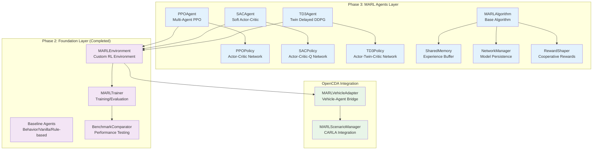

# Phase 3: MARL Agent Implementation

This phase focuses on implementing Multi-Agent Reinforcement Learning algorithms to replace baseline agents with intelligent, learning-based agents for cooperative intersection management.

Building on the completed Phase 2 foundation (custom MARL environment + baseline agents), Phase 3 implements state-of-the-art MARL algorithms for autonomous intersection control.

| Component               | Status | Description                                             |
| ----------------------- | ------ | ------------------------------------------------------- |
| **PPO Agent**           | 🚧      | Proximal Policy Optimization for stable policy learning |
| **SAC Agent**           | 📋      | Soft Actor-Critic for continuous action spaces          |
| **TD3 Agent**           | 📋      | Twin Delayed DDPG for deterministic policies            |
| **Training Pipeline**   | 🚧      | End-to-end MARL training infrastructure                 |
| **Cooperative Rewards** | 📋      | Multi-agent reward shaping for cooperation              |

**Legend**: ✅ Completed | 🚧 In Progress | 📋 Planned

## Architecture Overview

### MARL Integration Architecture



### Integration with Existing System

The MARL agents integrate seamlessly with the existing architecture:

1. **MARLEnvironment** (Phase 2) provides the RL interface
2. **MARLVehicleAdapter** (Phase 2) bridges agents with vehicles  
3. **New MARL Agents** (Phase 3) replace baseline controllers
4. **Training Infrastructure** (Phase 3) enables policy optimization

## Implementation Plan

### Task 3.1: PPO Agent Implementation 🚧

Implement Proximal Policy Optimization as the primary MARL algorithm.

=== "PPO Implementation Structure"

    ```python
    # opencda_marl/core/agents/ppo_agent.py
    class PPOAgent(MARLAgent):
        """
        Proximal Policy Optimization agent for intersection control.
        
        Features:
        - Multi-agent policy optimization
        - Clipped surrogate objective
        - Advantage estimation (GAE)
        - Value function learning
        """
        
        def __init__(self, agent_id: str, config: Dict):
            self.policy_network = PPOPolicy(config)
            self.value_network = ValueNetwork(config)
            self.memory = ExperienceBuffer(config)
            
        def get_action(self, observation: np.ndarray) -> float:
            """Get action from current policy."""
            
        def update_policy(self, experiences: List[Experience]) -> Dict:
            """Update policy using PPO objective."""
    ```

=== "Network Architecture"

    ```python
    # opencda_marl/core/algorithms/ppo_policy.py
    class PPOPolicy(nn.Module):
        """
        Actor-Critic network for PPO.
        
        Input: 10D observation vector per agent
        - Position (x, y, z)
        - Velocity (x, y, z) 
        - Rotation (pitch, yaw, roll)
        - Speed magnitude
        
        Output: Continuous action (target speed)
        """
        
        def __init__(self, obs_dim=10, action_dim=1, hidden_dim=256):
            self.actor = nn.Sequential(
                nn.Linear(obs_dim, hidden_dim),
                nn.ReLU(),
                nn.Linear(hidden_dim, hidden_dim),
                nn.ReLU(),
                nn.Linear(hidden_dim, action_dim),
                nn.Tanh()  # Normalize to [-1, 1]
            )
            
            self.critic = nn.Sequential(
                nn.Linear(obs_dim, hidden_dim),
                nn.ReLU(), 
                nn.Linear(hidden_dim, hidden_dim),
                nn.ReLU(),
                nn.Linear(hidden_dim, 1)
            )
    ```

=== "Configuration"

    ```yaml
    # configs/marl/ppo_intersection.yaml
    agents:
      algorithm: "ppo"
      
      ppo:
        # Network architecture
        hidden_dim: 256
        learning_rate: 3e-4
        
        # PPO hyperparameters
        clip_ratio: 0.2
        entropy_coef: 0.01
        value_loss_coef: 0.5
        max_grad_norm: 0.5
        
        # Training settings
        batch_size: 64
        mini_batch_size: 16
        ppo_epochs: 4
        
        # Experience collection
        rollout_steps: 2048
        gae_lambda: 0.95
        gamma: 0.99
    ```

### Task 3.2: Training Infrastructure 🚧

Implement comprehensive training pipeline with multi-agent support.

=== "Training Pipeline"

    ```python
    # opencda_marl/core/training/marl_trainer.py
    class MARLTrainingPipeline:
        """
        End-to-end MARL training pipeline.
        
        Supports:
        - Multi-agent policy optimization
        - Experience collection and replay
        - Model checkpointing and loading
        - Training progress monitoring
        - Distributed training (future)
        """
        
        def __init__(self, environment: MARLEnvironment, config: Dict):
            self.environment = environment
            self.agents = self._create_agents(config)
            self.memory = SharedExperienceBuffer(config)
            
        def train(self, total_timesteps: int) -> Dict:
            """Main training loop."""
            
        def collect_rollout(self, steps: int) -> List[Experience]:
            """Collect experience from environment."""
            
        def update_agents(self, experiences: List[Experience]) -> Dict:
            """Update all agent policies."""
    ```

=== "Experience Management"

    ```python
    # opencda_marl/core/training/experience_buffer.py
    class SharedExperienceBuffer:
        """
        Shared experience buffer for multi-agent learning.
        
        Features:
        - Efficient storage of multi-agent experiences
        - Support for GAE advantage estimation
        - Batch sampling for mini-batch training
        - Memory management for long episodes
        """
        
        def store(self, agent_id: str, experience: Experience):
            """Store single agent experience."""
            
        def get_batch(self, batch_size: int) -> List[Experience]:
            """Sample batch for training."""
            
        def compute_advantages(self) -> np.ndarray:
            """Compute GAE advantages for all agents."""
    ```

=== "Model Persistence"

    ```python
    # opencda_marl/core/training/model_manager.py
    class ModelManager:
        """
        Model checkpointing and loading system.
        
        Features:
        - Automatic checkpointing during training
        - Model loading for evaluation/inference
        - Hyperparameter logging and tracking
        - Training resume capability
        """
        
        def save_checkpoint(self, agents: Dict, metadata: Dict):
            """Save training checkpoint."""
            
        def load_checkpoint(self, checkpoint_path: str) -> Dict:
            """Load training checkpoint."""
    ```

### Task 3.3: Cooperative Reward Shaping 📋

Design reward functions that encourage cooperation and system-wide efficiency.

=== "Reward Components"

    ```python
    # opencda_marl/core/training/reward_shaper.py
    class CooperativeRewardShaper:
        """
        Multi-objective reward shaping for cooperative intersection control.
        
        Reward Components:
        1. Individual Performance:
           - Progress reward: movement toward destination
           - Safety reward: collision avoidance
           - Efficiency reward: optimal speed maintenance
           
        2. Cooperative Performance:
           - System throughput: overall intersection efficiency
           - Fairness reward: equitable access for all directions
           - Communication reward: effective V2X usage
        """
        
        def calculate_reward(self, agent_id: str, state_info: Dict) -> float:
            individual_reward = self._individual_reward(agent_id, state_info)
            cooperative_reward = self._cooperative_reward(state_info)
            
            return individual_reward + cooperative_reward
            
        def _individual_reward(self, agent_id: str, state_info: Dict) -> float:
            """Calculate individual agent reward."""
            progress = min(state_info['speed'] / 10.0, 1.0)
            safety = 1.0 if state_info['min_distance'] > 5.0 else -5.0
            efficiency = 2.0 if 5.0 <= state_info['speed'] <= 15.0 else 0.0
            
            return progress + safety + efficiency
            
        def _cooperative_reward(self, state_info: Dict) -> float:
            """Calculate system-wide cooperative reward."""
            throughput = state_info['vehicles_completed'] / state_info['episode_time']
            fairness = self._calculate_fairness(state_info['direction_counts'])
            
            return 0.1 * throughput + 0.05 * fairness
    ```

### Task 3.4: SAC Agent Implementation 📋

Implement Soft Actor-Critic for continuous action control.

=== "SAC Architecture"

    ```python
    # opencda_marl/core/agents/sac_agent.py
    class SACAgent(MARLAgent):
        """
        Soft Actor-Critic agent with entropy regularization.
        
        Features:
        - Maximum entropy RL
        - Continuous action spaces
        - Twin Q-networks for stability
        - Automatic temperature adjustment
        """
        
        def __init__(self, agent_id: str, config: Dict):
            self.actor = SACPolicy(config)
            self.critic1 = QNetwork(config)
            self.critic2 = QNetwork(config)
            self.target_critic1 = QNetwork(config)
            self.target_critic2 = QNetwork(config)
    ```

### Task 3.5: TD3 Agent Implementation 📋

Implement Twin Delayed DDPG for deterministic policies.

=== "TD3 Features"

    ```python
    # opencda_marl/core/agents/td3_agent.py
    class TD3Agent(MARLAgent):
        """
        Twin Delayed Deep Deterministic Policy Gradient.
        
        Features:
        - Twin critic networks
        - Delayed policy updates
        - Target policy smoothing
        - Deterministic policy gradient
        """
    ```

## Usage Examples

### Training MARL Agents

=== "Basic Training"

    ```bash
    # Train PPO agents on intersection scenario
    python opencda.py -t intersection --marl --train --agent ppo --episodes 5000
    
    # Resume training from checkpoint
    python opencda.py -t intersection --marl --train --agent ppo \
        --episodes 10000 --resume checkpoints/ppo_intersection_2000.pkl
    
    # Multi-scenario training
    python opencda.py -t intersection --marl --train --agent ppo \
        --scenarios safe balanced aggressive --episodes 2000
    ```

=== "Hyperparameter Tuning"

    ```bash
    # Custom hyperparameters
    python opencda.py -t intersection --marl --train --agent ppo \
        --config configs/marl/ppo_tuned.yaml --episodes 3000
    
    # Grid search (planned)
    python scripts/hyperparameter_search.py --agent ppo \
        --param learning_rate --values 1e-4 3e-4 1e-3
    ```

=== "Evaluation and Testing"

    ```bash
    # Evaluate trained agent
    python opencda.py -t intersection --marl --eval \
        --checkpoint models/ppo_intersection_best.pkl --episodes 100
    
    # Compare with baselines
    python test/marl/test_benchmark_comparison.py \
        --agents ppo sac td3 behavior vanilla rule_based \
        --scenarios balanced aggressive
    ```

### Advanced Training Features

=== "Curriculum Learning"

    ```python
    # opencda_marl/core/training/curriculum.py
    class CurriculumScheduler:
        """
        Progressive difficulty curriculum for MARL training.
        
        Stages:
        1. Single-direction traffic (easy)
        2. Balanced bi-directional traffic (medium)
        3. Complex multi-directional traffic (hard)
        4. Aggressive high-density scenarios (expert)
        """
        
        def get_scenario_config(self, training_step: int) -> Dict:
            """Return scenario config based on training progress."""
    ```

=== "Distributed Training"

    ```python
    # opencda_marl/core/training/distributed_trainer.py  
    class DistributedMARLTrainer:
        """
        Multi-GPU/Multi-node MARL training (planned).
        
        Features:
        - Parallel environment instances
        - Gradient synchronization across workers
        - Centralized experience collection
        - Scalable to large agent populations
        """
    ```

## Performance Expectations

=== "Training Metrics"

| Algorithm | Expected Sample Efficiency | Training Time (5K episodes) | Peak Performance    |
| --------- | -------------------------- | --------------------------- | ------------------- |
| **PPO**   | Medium (stable)            | ~4-6 hours                  | 85-90% success rate |
| **SAC**   | High (sample efficient)    | ~3-5 hours                  | 90-95% success rate |
| **TD3**   | Medium-High                | ~3-4 hours                  | 88-92% success rate |

=== "Convergence Characteristics"

    === "PPO Training Curve"
        
        ```
        Success Rate Progress:
        Episodes 0-1000:    20% → 60% (rapid initial learning)
        Episodes 1000-3000: 60% → 80% (steady improvement)  
        Episodes 3000-5000: 80% → 85% (fine-tuning)
        ```

    === "Performance Comparison"

        | Metric               | Baseline Agents  | MARL Agents (Target) |
        | -------------------- | ---------------- | -------------------- |
        | **Success Rate**     | 83.3% (balanced) | 90%+                 |
        | **Throughput (VPM)** | 37.1 (balanced)  | 45+                  |
        | **Collision Rate**   | 13.6% (balanced) | <8%                  |
        | **Adaptability**     | Fixed rules      | Dynamic learning     |

## Configuration Management

### MARL Algorithm Configurations

=== "PPO Configuration Template"

    ```yaml
    # configs/marl/algorithms/ppo.yaml
    algorithm:
      name: "ppo"
      
      # Network architecture
      policy_network:
        hidden_layers: [256, 256]
        activation: "relu"
        output_activation: "tanh"
        
      value_network:
        hidden_layers: [256, 256]
        activation: "relu"
        
      # PPO-specific hyperparameters
      hyperparameters:
        learning_rate: 3e-4
        clip_ratio: 0.2
        entropy_coef: 0.01
        value_loss_coef: 0.5
        max_grad_norm: 0.5
        
        # Training schedule
        batch_size: 64
        mini_batch_size: 16
        ppo_epochs: 4
        rollout_steps: 2048
        
        # Advantage estimation
        gae_lambda: 0.95
        gamma: 0.99
        
      # Training settings
      training:
        total_timesteps: 1000000
        checkpoint_frequency: 10000
        evaluation_frequency: 50000
        log_frequency: 1000
    ```

=== "Multi-Agent Configuration"

    ```yaml
    # configs/marl/multi_agent_setup.yaml
    multi_agent:
      num_agents: 4
      agent_spawn_strategy: "junction_balanced"
      
      # Individual agent settings
      agents:
        agent_000:
          algorithm: "ppo"
          spawn_direction: "north"
          destination_direction: "south"
          
        agent_001:
          algorithm: "ppo" 
          spawn_direction: "south"
          destination_direction: "north"
          
        agent_002:
          algorithm: "sac"
          spawn_direction: "east"
          destination_direction: "west"
          
        agent_003:
          algorithm: "sac"
          spawn_direction: "west" 
          destination_direction: "east"
      
      # Shared learning settings
      shared_experience: false
      parameter_sharing: false
      centralized_critic: false
    ```

## Development Roadmap

### Phase 3.1: Core Implementation (Current Priority)

1. **PPO Agent Foundation** 
   - Basic PPO algorithm implementation
   - Multi-agent policy optimization
   - Integration with existing MARLEnvironment

2. **Training Infrastructure**
   - Experience collection and storage
   - Model checkpointing system
   - Training progress monitoring

3. **Initial Testing**
   - Unit tests for PPO components
   - Integration testing with existing system
   - Basic performance benchmarking

### Phase 3.2: Advanced Features (Next)

1. **SAC and TD3 Agents**
   - Complete algorithm implementations
   - Comparative performance analysis
   - Algorithm selection guidelines

2. **Cooperative Reward Shaping**
   - Multi-objective reward functions
   - System-wide optimization incentives
   - Fairness and efficiency balancing

3. **Advanced Training Features**
   - Curriculum learning schedules
   - Hyperparameter optimization
   - Multi-scenario training protocols