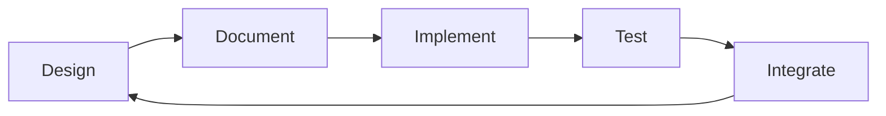

# OpenCDA-MARL Implementation Guide

This guide provides step-by-step instructions for developing MARL extensions to OpenCDA. Follow this guide to build functionality incrementally and avoid integration issues.

## Development Principles



=== "Documentation-Driven"

    - Write documentation and interfaces before implementation
    - Each component has clear purpose and API contract  
    - Examples and tests validate the design

=== "Incremental Development"

    - Implement one component at a time
    - Test each component in isolation
    - Integrate components step by step

=== "Backward Compatibility"

    - Never modify core OpenCDA files directly
    - Use adapter pattern for integration
    - All changes are opt-in through configuration

=== "Modular Architecture"

    - MARL components are self-contained
    - Clear separation of concerns
    - Easy to extend and customize


## Structure Reference

See [Architecture Documentation](../architecture.md#directory-structure) for the complete directory layout.

Key development directories:
```sh
opencda_marl/
├── core/           # Core MARL components (current focus)
├── envs/           # Gym environments  
├── agents/         # RL algorithms
├── scenarios/      # Training scenarios
└── utils/          # Utilities and helpers
```

## Development Process

Follow this implementation guide step-by-step to ensure robust, well-tested MARL extensions to OpenCDA. Each phase builds upon the previous one, maintaining backward compatibility and clean integration throughout the development process.

=== "Code Quality"

    - Follow PEP 8 style guidelines
    - Add type hints to all functions
    - Include comprehensive docstrings
    - Write unit tests for each component

=== "Error Handling"

    - Use try-catch blocks for external interfaces
    - Provide meaningful error messages
    - Implement graceful degradation
    - Log errors appropriately

=== "Configuration Management"

    - Use OmegaConf for configuration
    - Support configuration merging
    - Validate configurations at startup
    - Provide sensible defaults

=== "Testing Strategy"

    - Unit tests for individual components
    - Integration tests for component interaction
    - End-to-end tests for complete workflows
    - Performance benchmarks

=== "OpenCDA Integration"

    - Ensure CARLA is running on localhost:2000
    - Check OpenCDA installation and imports
    - Verify scenario configurations
    - Test with basic OpenCDA scenarios first before MARL


### ✅ Phase 1: Foundation Setup (Completed)

=== "Implementation Status: Complete"

    All foundation components have been successfully implemented and tested:

    - ✅ **Directory Structure**: Complete MARL module organization
    - ✅ **Package Initialization**: All `__init__.py` files with proper exports
    - ✅ **Map Management**: MARLMapAdapter with junction-aware spawn coordination
    - ✅ **Scenario System**: MARLScenarioManager with dynamic vehicle management
    - ✅ **MARL Coordinator**: Unified orchestration with multiple execution modes
    - ✅ **Custom Environment**: Direct CARLA integration replacing Gym complexity
    - ✅ **Vehicle Adapter**: Multi-controller support (behavior, vanilla, rule_based)
    - ✅ **Configuration System**: YAML-based with dynamic override capabilities
    - ✅ **Testing Infrastructure**: Comprehensive benchmark comparison system

=== "Key Achievements"

    - **Custom MARL Environment**: Replaced Gym wrapper with direct CARLA integration
    - **Agent Management**: Dynamic spawning with collision handling and cleanup
    - **Map Integration**: Junction-aware spawn points with OpenCDA compatibility
    - **Configuration System**: OmegaConf-based with traffic scenario presets
    - **Benchmark System**: Automated testing across multiple agent types
    - **CLI Integration**: Interactive and demo modes for development/testing

### ✅ Phase 2: Environment & Baseline Agents (Completed)

=== "Implementation Status: Complete"

    Custom environment and baseline agent suite fully implemented:

    - ✅ **MARLEnvironment**: Custom training environment with direct observation/reward/termination
    - ✅ **MARLTrainer**: Training and evaluation workflows without Gym dependency
    - ✅ **Baseline Agent Suite**: Three agent types for benchmarking and comparison
    - ✅ **Traffic Scenarios**: Standardized presets (safe, balanced, aggressive)
    - ✅ **Performance Metrics**: VPM-based throughput, success rate, collision rate
    - ✅ **Benchmark Infrastructure**: Automated testing with results export

=== "Baseline Agent Implementations"

    **BehaviorAgent**: OpenCDA standard autonomous driving agent
    - Uses OpenCDA BehaviorAgent for planning and control
    - Proven performance for comparison baseline
    - Full perception and planning pipeline

    **VanillaAgent**: Enhanced collision avoidance agent
    - Multi-vehicle TTC (Time-to-Collision) tracking
    - Intersection safety multipliers
    - Advanced lateral conflict detection
    - Predictive collision avoidance

    **RuleBasedAgent**: 3-stage intersection management
    - Stage 1: Junction approach and conflict detection
    - Stage 2: Car following with time headway control
    - Stage 3: Cruising at target speed
    - Configurable parameters for different traffic conditions

=== "Environment Features"

    **Direct CARLA Integration**:
    - No Gym wrapper complexity or agent ID mapping issues
    - Direct access to all CARLA simulation states
    - Natural fit for dynamic vehicle scenarios

    **Multi-objective Reward Function**:
    - Progress reward: Forward motion incentive
    - Safety reward: Distance-based collision avoidance
    - Efficiency reward: Optimal speed range maintenance

    **Episode Management**:
    - Clean episode reset without simulation restart
    - Dynamic vehicle spawning during episodes
    - Automatic collision cleanup with instant destruction

### 🚧 Phase 3: MARL Agent Policies (In Progress)

=== "Current Focus: RL Agent Implementation"

    - 🚧 **PPO Agent**: Proximal Policy Optimization implementation (stub exists)
    - 🚧 **SAC Agent**: Soft Actor-Critic implementation (stub exists) 
    - 🚧 **TD3 Agent**: Twin Delayed Deep Deterministic Policy Gradient (stub exists)
    - 🚧 **Training Integration**: Full RL training workflow
    - 🚧 **Reward Optimization**: Advanced cooperative reward shaping
    - 🚧 **Model Persistence**: Checkpointing and model loading system

    **Priority Implementation Tasks**:
    1. **Complete PPO Agent**: Implement policy network and training loop
    2. **Observation Processing**: Enhance observation space with neighbor information
    3. **Action Space Design**: Define appropriate action spaces for intersection scenarios
    4. **Training Pipeline**: Integrate with MARLTrainer for episode management
    5. **Evaluation Metrics**: RL-specific metrics and performance tracking

=== "Planned Agent Features"

    **Observation Space Enhancements**:
    - Neighbor vehicle information (position, velocity, heading)
    - Traffic light states and timing
    - Lane geometry and waypoint information
    - Communication messages (planned)

    **Action Space Options**:
    - Continuous: Target speed and steering angle
    - Discrete: Speed levels and lane change decisions
    - Hybrid: Continuous speed with discrete maneuvers

    **Training Improvements**:
    - Curriculum learning with increasing traffic complexity
    - Multi-objective optimization (safety + efficiency + cooperation)
    - Transfer learning across different intersection types

### 📋 Phase 4: Advanced Multi-Agent Features (Planned)

=== "Advanced MARL Capabilities"

    - 📋 **Multi-agent Algorithms**: MADDPG, QMIX implementations
    - 📋 **Agent Communication**: Message passing and coordination protocols
    - 📋 **Centralized Training**: Decentralized execution (CTDE) framework
    - 📋 **Attention Mechanisms**: Attention-based coordination for dynamic scenarios
    - 📋 **Curriculum Learning**: Progressive difficulty scaling
    - 📋 **Heterogeneous Policies**: Different agent types with specialized roles
    - 📋 **Distributed Training**: Multi-GPU and multi-node training support
    
    **Research Extensions**:
    - Graph Neural Networks for dynamic agent relationships
    - Communication-efficient coordination protocols
    - Hierarchical multi-agent learning architectures
    - Transfer learning across different scenario types
    - Sim-to-real adaptation techniques

## Development Guidelines

### MARL Agent Implementation Checklist

=== "Agent Development Workflow"

    When implementing a new MARL agent, follow this checklist:

    #### 1. Agent Class Setup
    ```python
    # Create agent class in opencda_marl/core/agents/
    class NewMARLAgent:
        def __init__(self, observation_space, action_space, config):
            # Initialize networks, optimizers, replay buffer
            pass
            
        def get_action(self, observation, training=True):
            # Return action for given observation
            pass
            
        def update(self, batch):
            # Update policy based on experience batch
            pass
            
        def save_model(self, path):
            # Save model checkpoint
            pass
            
        def load_model(self, path):
            # Load model checkpoint
            pass
    ```

    #### 2. Integration Testing
    - Test with single agent in intersection scenario
    - Verify observation and action spaces match expected formats
    - Test training loop with MARLTrainer
    - Benchmark against baseline agents (behavior, vanilla, rule_based)

    #### 3. Configuration Integration
    ```yaml
    # Add to configs/marl/default.yaml
    agents:
      new_agent:
        network:
          hidden_sizes: [256, 256]
          activation: "relu"
        training:
          learning_rate: 0.0003
          batch_size: 128
          buffer_size: 100000
    ```

    #### 4. Benchmark Testing
    ```bash
    # Test new agent with benchmark system
    python test/marl/test_benchmark_comparison.py --agents new_agent --scenarios balanced
    ```

### Performance Optimization Guidelines

=== "Training Performance"

    #### Observation Processing Optimization
    - Use efficient numpy operations for observation extraction
    - Consider observation caching for static elements
    - Implement observation preprocessing pipelines

    #### Episode Management
    - Minimize CARLA world resets (use scenario reset instead)
    - Batch experience collection across multiple agents
    - Use async episode execution where possible

    #### Memory Management
    - Monitor GPU memory usage during training
    - Implement experience replay with memory-efficient storage
    - Use gradient checkpointing for large networks

=== "Debugging Best Practices"

    #### Logging and Monitoring
    ```python
    # Use structured logging for agent debugging
    import logging
    
    logger = logging.getLogger(__name__)
    logger.info(f"Agent {agent_id}: Action={action}, Reward={reward:.3f}")
    ```

    #### Visualization Tools
    - Use CARLA spectator for real-time visualization
    - Implement custom observation viewers for debugging
    - Export episode replays for offline analysis

    #### Testing Strategies
    - Start with deterministic scenarios for debugging
    - Use traffic scenario presets for consistent testing
    - Implement unit tests for individual agent components

### Code Quality Standards

=== "Implementation Standards"

    #### Type Hints and Documentation
    ```python
    from typing import Dict, List, Optional, Tuple
    import numpy as np
    
    def get_observation(self, agent_id: str) -> np.ndarray:
        """
        Get observation for specific agent.
        
        Parameters
        ----------
        agent_id : str
            Unique agent identifier
            
        Returns
        -------
        observation : np.ndarray
            Agent observation vector
        """
    ```

    #### Error Handling
    ```python
    try:
        action = agent.get_action(observation)
    except Exception as e:
        logger.error(f"Agent {agent_id} action error: {e}")
        action = default_action  # Fallback action
    ```

    #### Configuration Validation
    ```python
    def validate_agent_config(config: Dict) -> bool:
        """Validate agent configuration parameters."""
        required_keys = ['network', 'training']
        return all(key in config for key in required_keys)
    ```

### Integration Testing Framework

=== "Testing Workflow"

    #### Unit Testing
    ```python
    # Test individual agent components
    def test_agent_initialization():
        agent = NewMARLAgent(obs_space, action_space, config)
        assert agent.policy is not None
        assert agent.optimizer is not None
    
    def test_action_generation():
        observation = np.random.random(obs_space.shape)
        action = agent.get_action(observation)
        assert action_space.contains(action)
    ```

    #### Integration Testing
    ```python
    # Test agent with MARL environment
    def test_agent_environment_integration():
        environment = MARLEnvironment(scenario_manager, config)
        trainer = MARLTrainer(environment)
        
        # Test single episode
        episode_stats = trainer.train_episode({'agent_1': agent})
        assert 'rewards' in episode_stats
        assert episode_stats['steps'] > 0
    ```

    #### Benchmark Testing
    ```bash
    # Automated benchmark testing
    python test/marl/test_benchmark_comparison.py \
        --agents new_agent behavior vanilla rule_based \
        --scenarios safe balanced aggressive \
        --timeout 300
    ```

This comprehensive implementation guide provides clear workflows for developing MARL agents while maintaining code quality and performance standards.  
