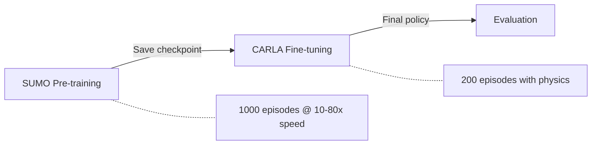

# SUMO MARL Training Guide

!!! warning "Development Status"
    SUMO-CARLA co-simulation training is under active development for **v1.1.0**. APIs and configurations may change.

## Overview

This guide explains how to use SUMO for accelerated MARL training with transfer learning to CARLA.

### Training Pipeline



### Performance Benefits

| Metric | CARLA-only | SUMO → CARLA Transfer |
|--------|------------|----------------------|
| **Training Time** | ~5-7 days | ~1.5 days total |
| **Episodes (1000)** | 168 hours | 12 hours (SUMO) + 24 hours (CARLA) |
| **Agent Scalability** | 10 agents max | 50+ agents in SUMO |
| **GPU Usage** | High | Low (CPU-only SUMO phase) |

---

## Quick Start

### 1. SUMO Pre-training

Train a policy in SUMO (10-80x faster than CARLA):

```bash
# Standard training
pixi run python opencda.py -t sumo --marl

# With SUMO GUI (visual debugging)
# Edit configs/marl/sumo.yaml: set sumo_gui: true
pixi run python opencda.py -t sumo --marl
```

**Training Progress:**

- Episodes 1-100: Exploration phase (high collision rate)
- Episodes 100-500: Learning phase (collision rate decreasing)
- Episodes 500-1000: Convergence phase (stable policy)

**Checkpoint Location:**

- `checkpoints/sumo_td3/latest_checkpoint.pth`
- `checkpoints/sumo_td3/episode_100_checkpoint.pth`
- `checkpoints/sumo_td3/episode_500_checkpoint.pth`

### 2. CARLA Fine-tuning

Transfer the SUMO policy to CARLA for physics-accurate fine-tuning. Use any CARLA-based config (e.g., `td3_simple_v4`) with `load_checkpoint` pointing to the SUMO checkpoint:

```yaml
# In your CARLA config (e.g., configs/marl/td3_simple_v4.yaml)
MARL:
  td3:
    learning_rate_actor: 5e-4   # Reduced for fine-tuning
    exploration_noise: 0.2      # Reduced from 0.5

  training:
    training_mode: true
    checkpoint_dir: "checkpoints/carla_finetune_td3/"
    load_checkpoint: "checkpoints/sumo_td3/latest_checkpoint.pth"

scenario:
  simulation:
    max_episodes: 200  # Fewer episodes needed with transfer
```

```bash
# Fine-tune with CARLA
pixi run python opencda.py -t td3_simple_v4 --marl
```

!!! tip "Pretrained Mode"
    When a checkpoint is loaded, the algorithm automatically skips the warmup phase (`_pretrained=True`), allowing fine-tuning to begin immediately.

### 3. Evaluation

Evaluate the fine-tuned policy:

```yaml
# In your CARLA config
MARL:
  training:
    training_mode: false  # Disable training
    load_checkpoint: "checkpoints/carla_finetune_td3/latest_checkpoint.pth"
```

```bash
pixi run python opencda.py -t td3_simple_v4 --marl
```

---

## Configuration

### SUMO Training Config

File: `configs/marl/sumo.yaml`

```yaml
meta:
  scenario_type: "intersection_sumo"
  simulator: "sumo"
  sumo_cfg: "opencda_marl/assets/intersection_sumo/intersection.sumocfg"

world:
  sync_mode: true
  fixed_delta_seconds: 0.05
  sumo_port: 8873
  sumo_gui: true  # Set to false for headless training

scenario:
  simulation:
    max_steps: 2400
    max_episodes: 1000

agents:
  count: 10  # Can scale to 50+ in SUMO
  agent_type: "marl"

MARL:
  algorithm: "td3"
  state_dim: 9
  action_dim: 1

  td3:
    features:
      rel_x: 1
      rel_y: 1
      position_x: 1
      position_y: 1
      lane_position: 1
      heading_angle: 1
      dist_to_intersection: 1
      dist_to_front_vehicle: 1
      waypoint_buffer: 1

    exploration_noise: 0.5  # Higher exploration in SUMO
    warmup_steps: 500

  training:
    training_mode: true
    checkpoint_dir: "checkpoints/sumo_td3/"
    save_freq: 10
    load_checkpoint: null  # Set to path for resuming

  rewards:
    collision: -500.0
    success: 400.0
    step_penalty: -1.5
    speed_bonus: 0.5
```

---

## Advanced Usage

### Scaling Agent Count

SUMO can handle 50+ agents simultaneously:

```yaml
# configs/marl/sumo.yaml
agents:
  count: 50
```

### Custom SUMO Networks

1. Place a custom XODR file in `opencda_marl/assets/maps/`
2. Convert to SUMO network:
   ```bash
   pixi run python scripts/convert_xodr_to_sumo.py
   ```
   This generates `.net.xml`, `.rou.xml`, and `.sumocfg` files.
3. Update config:
   ```yaml
   meta:
     sumo_cfg: "opencda_marl/assets/custom_intersection/custom.sumocfg"
   ```

### Monitoring Training

Enable SUMO GUI for visual debugging:

```yaml
# configs/marl/sumo.yaml
world:
  sumo_gui: true
```

Inspect checkpoint quality:

```python
import torch

ckpt = torch.load("checkpoints/sumo_td3/episode_500_checkpoint.pth")
print(f"Episode: {ckpt['episode']}")
print(f"Collision rate: {ckpt['metrics']['collision_rate']}")
print(f"Success rate: {ckpt['metrics']['success_rate']}")
```

---

## Troubleshooting

### SUMO Connection Error

**Error:**
```
traci.exceptions.TraCIException: Could not connect to TraCI server at localhost:8873
```

**Solution:**

1. Verify `SUMO_HOME` is set:
   ```bash
   echo $SUMO_HOME  # Should point to SUMO installation
   ```
2. Check port availability:
   ```bash
   netstat -an | grep 8873
   ```
3. Change port in config if needed:
   ```yaml
   world:
     sumo_port: 8874
   ```

### Transfer Learning Gap

**Problem:** Policy trained in SUMO performs poorly in CARLA

**Solutions:**

1. **Increase fine-tuning episodes:**
   ```yaml
   scenario:
     simulation:
       max_episodes: 500
   ```

2. **Reduce fine-tuning learning rate further:**
   ```yaml
   MARL:
     td3:
       learning_rate_actor: 1e-4
   ```

3. **Add domain randomization in SUMO:**
   ```yaml
   scenario:
     traffic:
       speed_variation: 0.3
   ```

### Out of Memory During CARLA Fine-tuning

Reduce agent count in the CARLA config:

```yaml
agents:
  count: 5
```

---

## Performance Benchmarks

### Training Time (1000 episodes, 10 agents)

| Setup | Time | Speedup |
|-------|------|---------|
| CARLA-only (RTX 5090) | ~5-7 days | 1x |
| SUMO-only | ~12 hours | **10-14x** |
| SUMO (900) + CARLA (100) | ~1.5 days | **3-5x** |

### Memory Usage

| Setup | GPU VRAM | System RAM |
|-------|----------|-----------|
| CARLA (10 agents) | ~8-12 GB | ~4 GB |
| SUMO (50 agents) | 0 GB | ~2 GB |

---

## Best Practices

### 1. Observation Space Consistency

SUMO and CARLA must use identical observation features. The current 9D feature set:

| Feature | Description |
|---------|-------------|
| `rel_x` | Relative X position to intersection |
| `rel_y` | Relative Y position to intersection |
| `position_x` | Absolute X position |
| `position_y` | Absolute Y position |
| `lane_position` | Lane offset |
| `heading_angle` | Vehicle heading (radians) |
| `dist_to_intersection` | Distance to intersection center |
| `dist_to_front_vehicle` | Gap to leading vehicle |
| `waypoint_buffer` | Waypoint-based path feature |

!!! danger "Important"
    Do NOT modify feature extraction in SUMO without updating the CARLA config to match.

### 2. Reward Structure

Keep rewards identical between SUMO and CARLA:

```yaml
rewards:
  collision: -500.0
  success: 400.0
  step_penalty: -1.5
  speed_bonus: 0.5
```

### 3. Hyperparameter Tuning

Only tune these during fine-tuning:

- `learning_rate_actor` / `learning_rate_critic`
- `exploration_noise`
- `warmup_steps`

Keep these **fixed** (must match SUMO):

- `state_dim` / `action_dim`
- Network architecture (`conflict_encoder`, `motion_planner`)
- `discount`, `tau`, etc.

### 4. Checkpoint Management

Save frequently in SUMO (fast and cheap):

```yaml
training:
  save_freq: 10  # Every 10 episodes
```

Save less frequently in CARLA (resource intensive):

```yaml
training:
  save_freq: 5
```

---

## Architecture

### SUMO Adapter Layer

The SUMO integration provides CARLA-compatible interfaces for seamless policy transfer:

| Component | File | Description |
|-----------|------|-------------|
| **SumoMARLEnv** | `opencda_marl/envs/sumo_marl_env.py` | SUMO-only training environment |
| **SumoAdapter** | `opencda_marl/core/traffic/sumo_adapter.py` | CARLA-compatible waypoint/map wrappers |
| **SumoSpawner** | `opencda_marl/core/traffic/sumo_spawner.py` | Vehicle spawning via TraCI |
| **XODR Converter** | `scripts/convert_xodr_to_sumo.py` | OpenDRIVE → SUMO network converter |

The adapter layer converts between SUMO and CARLA coordinate systems (offset: `99.8, 100.0`) and provides compatible `SumoWaypoint`, `SumoJunction`, `SumoWorld`, and `SumoMap` classes.

---

## References

- [SUMO Documentation](https://sumo.dlr.de/docs/)
- [TraCI API Reference](https://sumo.dlr.de/docs/TraCI.html)
- [OpenCDA Documentation](https://opencda-documentation.readthedocs.io/en/latest/)
