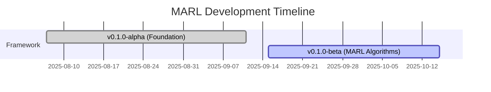

# MARL Development Updates

This page tracks the development progress of the OpenCDA-MARL extension, documenting all
modifications, features, and improvements across versions.

!!! info "Version Tracking"
    The MARL extension follows semantic versioning (MAJOR.MINOR.PATCH)aligned with OpenCDA releases. Current version: **0.1.0-alpha** (Initial Development)

## Release Timeline



| Version     | Release Date | Status       | Highlights                 |
| ----------- | ------------ | ------------ | -------------------------- |
| 0.1.0-alpha | 2025-08-07   | ✅Current     | Foundation & Documentation |
| 0.1.0-beta  | 2025-09-15   | 🚧Development | MARL algorithms            |

## Current Development

!!! warning "No Breaking Changes"
    The MARL extension is designed to be non-invasive. All OpenCDA functionality remains unchanged.

### v0.1.0-alpha (Foundation)

OpenCDA-MARL v0.1.0-alpha establishes the foundational Multi-Agent Reinforcement Learning framework with implementing a comprehensive 3-layer architecture. The system provides four distinct agent types including behavior, vanilla, rule-based, and MARL agents managed through a centralized agent factory pattern. Core RL algorithms are implemented with Q-Learning (discrete state/action spaces), DQN (deep neural network approximation), and TD3 (continuous control) providing diverse learning approaches for intersection scenarios.

The MARL environment system features custom CARLA integration with observation extraction, multi-objective reward calculation, and cross-agent evaluation capabilities. A Qt-based GUI dashboard enables real-time visualization, manual simulation control, and agent observation monitoring. Vehicle adapters serve as the critical bridge layer between OpenCDA's proven autonomous driving stack and MARL control systems, preserving all original OpenCDA functionality while enabling RL-based decision making.

The implementation focuses on intersection scenarios with custom XODR maps and traffic replay patterns, establishing a solid foundation for multi-agent research in cooperative autonomous driving. Registry-based map management provides predictable loading behavior with support for custom intersection environments and automated spawn point generation based on junction analysis.

## Changelog Template

When adding changelog entries:

1. **Version File**: Create/update version-specific file (e.g., `v0.2.0.md`)
2. **Categories**: Use consistent categories (Architecture, APIs, Config, etc.)
3. **Impact**: Note breaking changes and migration requirements
4. **Examples**: Include code examples for significant changes
5. **Links**: Reference related issues, PRs, and documentation

!!! info "Version Scheme"
    MARL follows semantic versioning: MAJOR.MINOR.PATCH

    - **MAJOR**: Breaking changes
    - **MINOR**: New features (backward compatible)
    - **PATCH**: Bug fixes, documentation updates

```markdown
# Version X.Y.Z Changelog

**Release Date**: YYYY-MM  
**Status**: Current/Development/Planned  
**Theme**: Brief description

## 🎯 Major Features
[Feature descriptions with code examples]

## 🔧 Technical Details
[Implementation details]

## 🐛 Bug Fixes
[Fixed issues]

## 📊 Performance
[Performance improvements]

## 🚧 Known Limitations
[Current limitations]

## 📝 API Changes
[New/modified APIs]

## 🔄 Migration Notes
[Migration instructions]
```

!!! tip "Stay Updated"
    Watch the [GitHub repository](https://github.com/radar-lab/OpenCDA-MARL) for the latest updates and releases.
