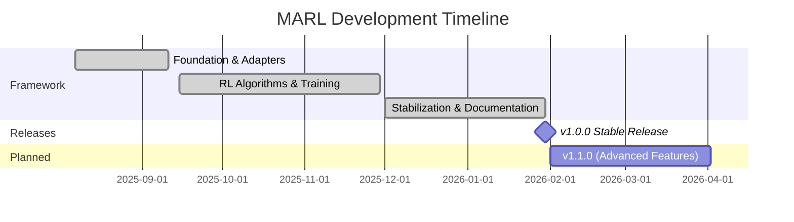

# MARL Development Updates

This page tracks the development progress of the OpenCDA-MARL extension, documenting all
modifications, features, and improvements across versions.

!!! success "Version Tracking"
    Current stable release: **v1.0.0** — Complete MARL framework with five RL algorithms, training infrastructure, and evaluation tools.

## Release Timeline



| Version | Release Date | Status  | Highlights                                              |
| ------- | ------------ | ------- | ------------------------------------------------------- |
| 1.0.0   | 2026-01-30   | Stable  | Complete MARL framework, 5 algorithms, training, GUI    |
| 1.1.0   | 2026 Q1      | Planned | Advanced features & optimizations                       |

## v1.0.0 (Stable Release)

!!! warning "No Breaking Changes"
    The MARL extension is designed to be non-invasive. All OpenCDA functionality remains unchanged.

The first stable release consolidates all development phases into a complete, production-ready MARL framework.

### Core Framework

OpenCDA-MARL provides a comprehensive 3-layer architecture for multi-agent reinforcement learning in autonomous driving. The system includes four agent types (behavior, vanilla, rule-based, MARL) managed through a centralized factory pattern. Vehicle adapters bridge OpenCDA's autonomous driving stack with MARL control systems.

The MARLEnv environment provides custom CARLA integration with observation extraction, multi-objective reward calculation, and cross-agent evaluation. A PySide6 Qt-based GUI dashboard enables real-time visualization and interactive control.

### RL Algorithm Suite

=== "Algorithms"

    Five RL algorithms with a shared `BaseAlgorithm` interface:

    | Algorithm | Type | Key Features |
    |-----------|------|-------------|
    | **TD3** | Continuous | LSTM encoder, multi-agent context, prioritized replay |
    | **DQN** | Discrete | Epsilon-greedy, target network, gradient clipping |
    | **Q-Learning** | Discrete | Tabular, configurable state bins |
    | **MAPPO** | On-Policy | GAE, rollout buffer, Gaussian actor |
    | **SAC** | Continuous | Entropy regularization, auto-tuning alpha |

=== "Training Infrastructure"

    - **MARLManager**: Algorithm orchestrator with training/evaluation modes
    - **ObservationExtractor**: 9 configurable feature types for RL observation vectors
    - **CheckpointManager**: Structured model saving (latest, best, per-episode)
    - **TrainingMetrics**: Per-episode statistics with CSV export
    - **SmartReplayBuffer**: Pre-allocated numpy arrays with recency bias (50% recent + 50% diverse)
    - **PrioritizedReplayBuffer**: TD-error weighted experience sampling
    - **TensorBoard**: Comprehensive logging (losses, Q-values, gradients, convergence)
    - **Convergence Detection**: CV-based (< 15%), success rate stability, min 20 episodes

=== "SUMO Integration"

    - **SumoMarlEnv**: Lightweight SUMO-only environment for traffic simulation
    - **SUMO adapter/spawner**: Vehicle spawning and control in SUMO
    - Enables large-scale experiments without CARLA overhead

## Planned: v1.1.0

- Advanced multi-agent communication protocols
- Curriculum learning for progressive scenario difficulty
- Distributed training support
- Highway and parking scenario templates
- Performance benchmarking across algorithms

## Changelog Template

When adding changelog entries:

1. **Version File**: Create/update version-specific file (e.g., `v1.1.0.md`)
2. **Categories**: Use consistent categories (Architecture, APIs, Config, etc.)
3. **Impact**: Note breaking changes and migration requirements
4. **Examples**: Include code examples for significant changes
5. **Links**: Reference related issues, PRs, and documentation

!!! info "Version Scheme"
    MARL follows semantic versioning: MAJOR.MINOR.PATCH

    - **MAJOR**: Breaking changes
    - **MINOR**: New features (backward compatible)
    - **PATCH**: Bug fixes, documentation updates

```markdown
# Version X.Y.Z Changelog

**Release Date**: YYYY-MM
**Status**: Current/Development/Planned
**Theme**: Brief description

## Major Features
[Feature descriptions with code examples]

## Technical Details
[Implementation details]

## Bug Fixes
[Fixed issues]

## Performance
[Performance improvements]

## Known Limitations
[Current limitations]

## API Changes
[New/modified APIs]

## Migration Notes
[Migration instructions]
```

!!! tip "Stay Updated"
    Watch the [GitHub repository](https://github.com/radar-lab/opencda-marl) for the latest updates and releases.
