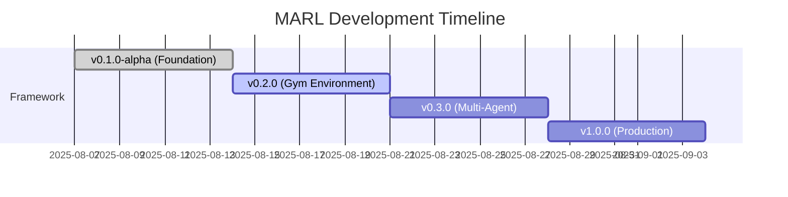

# MARL Development Updates

This page tracks the development progress of the OpenCDA-MARL extension, documenting all
modifications, features, and improvements across versions.

!!! info "Version Tracking" 
    The MARL extension follows semantic versioning (MAJOR.MINOR.PATCH)aligned with OpenCDA releases. Current version: **0.1.0-alpha** (Initial Development)

## Release Timeline



| Version     | Release Date | Status       | Highlights                                    |
| ----------- | ------------ | ------------ | --------------------------------------------- |
| 0.1.0-alpha | 2025-08-07   | ✅Current     | Initial framework, map manager, documentation |
| 0.2.0       | 2025-08-14   | 🚧Development | Gym environment, basic RL algorithms          |
| 0.3.0       | 2025-08-21   | 📋Planned     | Multi-agent scenarios, advanced training      |
| 1.0.0       | 2025-08-28   | 📋Planned     | Production-ready, full documentation          |

## Current Development

!!! warning "No Breaking Changes" 
    The MARL extension is designed to be non-invasive. All OpenCDA functionality remains unchanged.


### v0.1.0-alpha

We migrated MARL map management to a registry‑first design. The previous on‑disk discovery in _discover_available_maps is replaced by verification of the `AVAILABLE_MAPS` registry on startup, with optional discovery behind config.map.auto_discover (default: False). Each map entry may now include explicit xodr_path/fbx_path so loaders don't recompute paths, while runtime validation annotates has_mesh and prunes missing assets. Custom maps are loaded via opencda.scenario_testing.utils.customized_map_api.load_customized_world (with a local fallback), avoiding wheel changes and acknowledging CARLA cannot dynamically load textures; FBX presence is advisory only. CARLA built‑in map loading remains unchanged. This yields predictable behavior, simpler external map registration, and no redundant path handling.

## Changelog Template

When adding changelog entries:

1. **Version File**: Create/update version-specific file (e.g., `v0.2.0.md`)
2. **Categories**: Use consistent categories (Architecture, APIs, Config, etc.)
3. **Impact**: Note breaking changes and migration requirements
4. **Examples**: Include code examples for significant changes
5. **Links**: Reference related issues, PRs, and documentation

!!! info "Version Scheme"
    MARL follows semantic versioning: MAJOR.MINOR.PATCH

    - **MAJOR**: Breaking changes
    - **MINOR**: New features (backward compatible)
    - **PATCH**: Bug fixes, documentation updates

```markdown
# Version X.Y.Z Changelog

**Release Date**: YYYY-MM  
**Status**: Current/Development/Planned  
**Theme**: Brief description

## 🎯 Major Features
[Feature descriptions with code examples]

## 🔧 Technical Details
[Implementation details]

## 🐛 Bug Fixes
[Fixed issues]

## 📊 Performance
[Performance improvements]

## 🚧 Known Limitations
[Current limitations]

## 📝 API Changes
[New/modified APIs]

## 🔄 Migration Notes
[Migration instructions]
```

!!! tip "Stay Updated" 
    Watch the [GitHub repository](https://github.com/radar-lab/OpenCDA-MARL) for the latest updates and releases.
