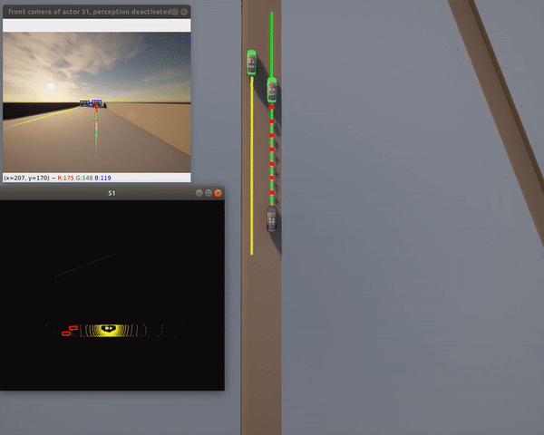
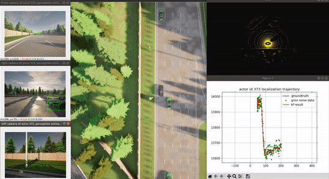
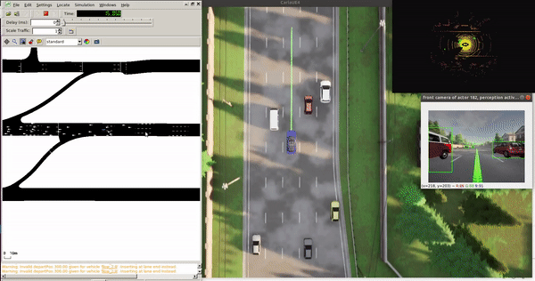
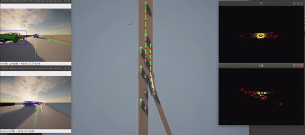
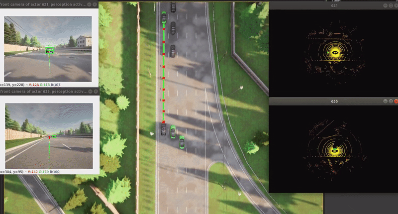
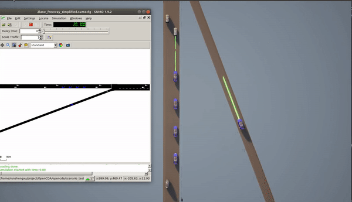
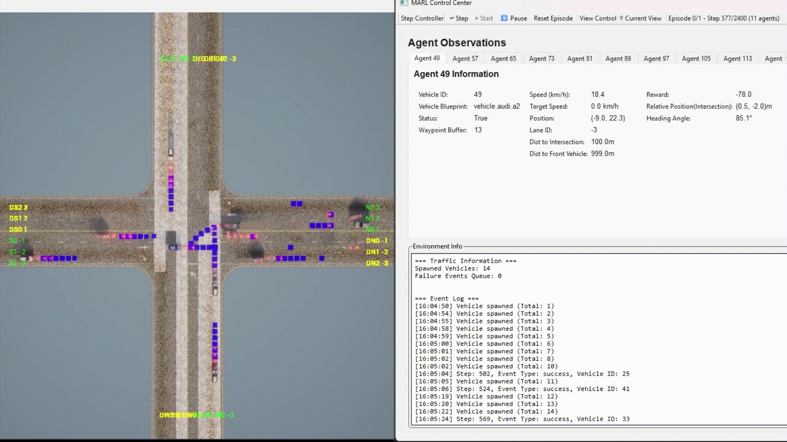

# Quick Start Guide

Get started with OpenCDA for cooperative driving automation research and OpenCDA-MARL for multi-agent reinforcement learning scenarios.

---

## OpenCDA Scenarios

**What it provides**: Pre-configured benchmark scenarios for cooperative driving research

```bash
pixi run start -t <scenario_name> [--apply_ml] [--record]
```

**Parameters**:

- `-t`: Scenario name (must have matching `.py` in `configs/opencda/scenario_testing/` and `.yaml` in `configs/opencda/`)
- `--apply_ml`: Enable ML models (requires PyTorch)
- `--record`: Record simulation for replay

**Note**: Version argument (`-v`) has been removed. OpenCDA now uses CARLA 0.9.15 exclusively.

---

### Single Vehicle Tests

=== "Highway Navigation"
    ```bash
    # Basic 2-lane highway test (no ML required)
    pixi run start -t single_2lanefree_carla
    ```

    **Features**:

    - 100 km/h target speed
    - Safe traffic interaction
    - Localization, planning, control modules active
    - Perception disabled by default (no PyTorch needed)
    
    

=== "Urban with ML"
    ```bash
    # Town06 with YOLOv8/YOLOv5 detection
    pixi run start -t single_town06_carla --apply_ml
    ```

    **Features**:

    - Full perception pipeline with ML
    - Urban environment navigation
    - Camera-LiDAR fusion
    - **Requires**: PyTorch, CUDA (recommended)
    
    

=== "SUMO Co-simulation"
    ```bash
    # Town06 with SUMO traffic generation
    pixi run start -t single_town06_cosim --apply_ml
    ```

    **Features**:

    - SUMO-generated traffic flow
    - More realistic traffic patterns
    - ML-based 3D object detection
    - **Requires**: PyTorch, SUMO
    
    

**Tip**: Bounding boxes in non-ML mode come from CARLA ground truth. With `--apply_ml`, they're from the detection model.

---

### Cooperative Driving Tests

=== "Platoon Stability"
    ```bash
    # Test platoon stability under speed changes
    pixi run start -t platoon_stability_2lanefree_carla
    ```

    **Features**:
    - 4-vehicle platoon
    - Dynamic speed changes
    - Time gap maintenance
    - Stability verification

=== "Platoon Joining"
    ```bash
    # Cooperative merge and platoon joining
    pixi run start -t platoon_joining_2lanefree_carla
    ```

    **Features**:
    - Mainline platoon with traffic
    - Cooperative merging from ramp
    - V2X communication
    - Real-time formation adjustment
    
    

=== "Platoon Back-Join"
    ```bash
    # Join platoon from behind with ML
    pixi run start -t platoon_joining_town06_carla --apply_ml
    ```

    **Features**:
    - Overtaking maneuvers
    - YOLOv8/YOLOv5 detection
    - Complex urban scenario
    - **Requires**: PyTorch
    
    

=== "SUMO Platoon"
    ```bash
    # Platoon with SUMO co-simulation
    pixi run start -t platoon_joining_2lanefree_cosim
    ```

    **Features**:
    - SUMO traffic integration
    - Realistic traffic patterns
    - **Requires**: SUMO
    
    

---

### Advanced Scenarios

=== "Cooperative Perception"
    ```bash
    # V2X-enabled perception sharing
    pixi run start -t cooperception_cavs_town05 --apply_ml
    ```

    **Features**:
    - Shared object detection via V2X
    - Extended perception range
    - Occlusion handling
    - Multi-vehicle fusion

=== "Intersection Management"
    ```bash
    # Cooperative intersection navigation
    pixi run start -t intersection_town05 --apply_ml
    ```

    **Features**:
    - Traffic light compliance
    - V2I communication
    - Conflict resolution
    - Safety validation

**Performance**: Most scenarios run at 20 FPS simulation time on modern GPUs

---

### Configuration & Customization

**What you can modify**: Scenarios, vehicle behaviors, perception models

=== "YAML Configuration"
    ```yaml
    # Example: Modify perception settings
    vehicle:
      sensing:
        perception:
          activate: true  # Enable ML perception
          camera:
            fov: 100
            image_size_x: 800
            image_size_y: 600
        localization:
          gnss:
            noise_alt_stddev: 0.1  # Add GPS noise
    ```

=== "Custom ML Models"
    ```python
    # Add custom detection model
    from opencda.customize.ml_libs.ml_manager import MLManager

    class CustomDetector(MLManager):
        def __init__(self):
            super().__init__()
            self.model = load_your_model()
        
        def detect(self, image):
            return self.model(image)
    ```

=== "Scenario Creation"
    ```python
    # Create new scenario
    from opencda.scenario_testing.scenario_manager import ScenarioManager

    def custom_scenario():
        scenario_manager = ScenarioManager(config, apply_ml=True)
        
        # Spawn vehicles
        cavs = scenario_manager.create_vehicle_manager(['custom'])
        
        # Run simulation
        while True:
            scenario_manager.tick()
            # Custom logic here
    ```

**Tips**:

- Check `configs/opencda/{config_yaml}.yaml` for configuration examples
- Use `opencda/customize/` for custom implementations
- See [YAML Configuration Guide](opencda/yaml_define.md) for all options

---

## OpenCDA-MARL

**What it provides**: Multi-Agent Reinforcement Learning capabilities for cooperative driving research


### Quick Test

```bash
# Run MARL intersection scenario with rule-based agents
pixi run marl-quick-test
```

**Optional parameters**:

- `--gui`: Enable GUI visualization
- `-t <scenario_name>`: Scenario name (`.yaml` in `configs/marl/`)

**Example with GUI**:

```bash
pixi run marl-quick-test-gui
```



### Agent Types

**What you can choose**: Different agent implementations for intersection scenarios

=== "Configuration Method"
    ```yaml
    # Set agent type in any config file
    agents:
      agent_type: "rule_based"  # or "behavior", "vanilla", "marl"

    # Override agent behavior parameters
    agents:
      agent_type: "marl"
      marl:
        max_speed: 65           # Custom max speed
        emergency_param: 0.4    # Safety threshold
        ignore_traffic_light: true
    ```

=== "Rule-based Agent"
    ```bash
    # 3-stage rule-based intersection navigation
    pixi run marl-quick-test -t intersection_rule_based
    ```

    **Features**:
    - Deterministic behavior
    - Safety-first approach
    - No training required
    - Predictable performance

=== "Behavior Agent"
    ```bash
    # Enhanced safety agent with collision avoidance
    pixi run marl-quick-test -t intersection_behavior
    ```

    **Features**:
    - Enhanced safety mechanisms
    - Dynamic collision avoidance
    - Adaptive speed control

=== "Vanilla Agent"
    ```bash
    # Basic agent with standard safety features
    pixi run marl-quick-test -t intersection_vanilla
    ```

    **Features**:
    - Standard safety features
    - Basic collision detection
    - Simple control logic

---

### RL Algorithms

**What's implemented**: Reinforcement learning agents for intersection control

=== "Q-Learning"
    ```bash
    # Q-table based learning (balanced configuration)
    pixi run marl-quick-test -t qbalanced
    ```

    **Configuration**:
    ```yaml
    agents:
      agent_type: "marl"

    MARL:
      algorithm: "q_learning"
      q_learning:
        speed_actions: [15, 35, 65]  # Discrete actions
        state_features:
          distance_to_intersection:
            bins: [0, 5, 15]
          speed:
            bins: [0, 30]
        epsilon: 0.1
        learning_rate: 0.2
    ```

=== "Deep Q-Network (DQN)"
    ```bash
    # Neural network Q-learning
    pixi run marl-quick-test -t dqn
    ```

    **Configuration**:
    ```yaml
    agents:
      agent_type: "marl"
      
    MARL:
      algorithm: "dqn"
      state_dim: 7  # Continuous state space
      dqn:
        speed_actions: [30, 45, 60]  # Discrete actions
        learning_rate: 0.001
        memory_size: 50000
        batch_size: 32
    ```

=== "MATD3 (Twin Delayed DDPG)"
    ```bash
    # Continuous control with TD3
    pixi run marl-quick-test -t td3_simple
    ```

    **Configuration**:
    ```yaml
    agents:
      agent_type: "marl"
      
    MARL:
      algorithm: "td3"
      state_dim: 9  # 9D feature space
      action_dim: 1  # Continuous speed control
      td3:
        learning_rate_actor: 0.001
        learning_rate_critic: 0.001
        exploration_noise: 0.5
    ```

=== "MASAC (Soft Actor Critic)"
    ```bash
    # Soft Actor Critic with auto-tuning entropy
    pixi run marl-quick-test -t sac
    ```

    **Configuration**:
    ```yaml
    agents:
      agent_type: "marl"
      marl:
        algorithm: "sac"
        sac:
          learning_rate_actor: 0.001
          learning_rate_critic: 0.001
          learning_rate_alpha: 0.001
          auto_entropy_tuning: true
          target_entropy: -1.0
          init_alpha: 0.2
    ```

=== "MAPPO (Multi-Agent PPO)"
    ```bash
    # Multi-Agent PPO with CTDE
    pixi run marl-quick-test -t mappo
    ```
    
    **Configuration**:
    ```yaml
    agents:
      agent_type: "marl"
      marl:
        algorithm: "mappo"
        mappo:
          learning_rate: 0.001
          tau: 0.005
          alpha: 0.2
    ```

### Configuration & Customization

**What you can modify**: Override default settings for specific scenarios

=== "Config Hierarchy"
    ```yaml
    # configs/marl/default.yaml provides base settings
    agents:
      behavior:
        max_speed: 45        # Default from base config
        emergency_param: 0.4
        ignore_traffic_light: false

    # Your scenario config can override specific fields
    agents:
      agent_type: "marl"
      marl:
        max_speed: 65        # Override: faster for RL training
        ignore_traffic_light: true  # Override: focus on intersection
    ```

=== "Agent Behavior Override"
    ```yaml
    # Customize agent behavior in any scenario config
    agents:
      agent_type: "rule_based"
      rule_based:
        max_speed: 50                    # Custom speed limit
        junction_approach_distance: 80.0 # Longer approach distance
        time_headway: 2.5               # Tighter following

    # Works for all agent types
    agents:
      vanilla:
        collision_time_ahead: 2.0  # More conservative
        emergency_param: 0.3       # Earlier emergency braking
    ```

=== "Algorithm Parameters"
    ```yaml
    # Fine-tune RL algorithm parameters
    agents:
      agent_type: "marl"

    MARL:
      algorithm: "dqn"
      dqn:
        learning_rate: 0.0005      # Slower learning
        epsilon: 0.05              # Less exploration
        memory_size: 100000        # Larger replay buffer

    # Or switch algorithms easily
    agents:
      agent_type: "marl"
      
    MARL:
      algorithm: "q_learning"      # Change from DQN to Q-learning
      q_learning:
        epsilon: 0.2               # More exploration for Q-table
    ```

---

### Traffic Configuration

**What you can modify**: Traffic flow settings and vehicle spawn patterns

=== "Traffic Modes"
    ```yaml
    # Replay recorded traffic patterns
    scenario:
      traffic:
        mode: "replay"
        replay_file: "recordings/lite_2minL.json"
        base_speed: 45.0  # km/h base speed
    ```

=== "Traffic Flows"
    ```yaml
    # Configure directional traffic flows
    scenario:
      traffic:
        flows:
          - name: "north"
            rate_vph: 200        # Vehicles per hour
            lanes: [0, 1, 2]     # Lane indices
            direction: "north"
            speed_variation: 0.2
            middle_peak:
              intensity: 0.4     # Peak density multiplier
              position: 0.5      # Peak timing (0.0-1.0)
              width: 0.3         # Peak duration
    ```

=== "Custom Configuration"
    ```yaml
    # Create custom scenario configuration
    agents:
      agent_type: "marl"  # or "rule_based", "behavior", "vanilla"

    MARL:
      algorithm: "dqn"    # or "q_learning", "td3"

    scenario:
      simulation:
        max_steps: 2400   # Simulation duration
        max_episodes: 100 # Training episodes
    ```

---

## More Information

- **OpenCDA Users**: Explore [scenario testing](opencda/scenarios.md) and [API documentation](api/opencda/overview.md)
- **MARL Researchers**: Check [MARL architecture](marl/architecture.md) and [development updates](marl/updates.md)
- **Contributors**: See [contributing guide](contributing.md)
- **Related Documentation**:
    - [Installation](installation.md)
    - [OpenCDA](opencda/core.md)
    - [API Reference](api/opencda/overview.md)
    - [OpenCDA Official Documentation](https://opencda.readthedocs.io/en/latest/)
    - [Carla Official Documentation](https://carla.readthedocs.io/en/latest/)
